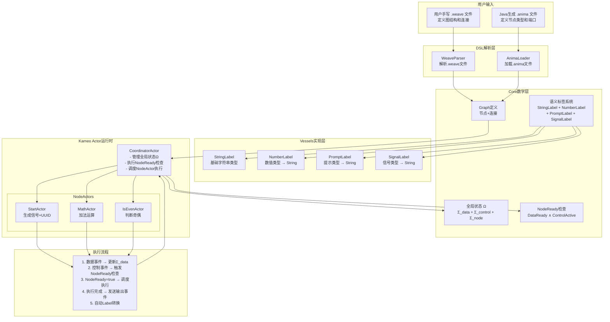

# AnimaWeave Rust 实现进度

## 架构图

## 实现进度

### ✅ Core数学层
- [x] Graph结构 (`graph.rs`)
- [x] Port, Connection, Node定义
- [x] ActivationMode, ConcurrentMode配置
- [x] **语义标签系统trait** (`label.rs`) - 🆕 完成
- [x] 语义标签宏系统 (`semantic_label!`) - 🆕 完成
- [x] 事件系统trait (`event.rs`) - ⚠️ 需重构以支持SemanticLabel
- [x] 全局状态trait (`state.rs`) 
- [x] 执行器trait (`executor.rs`)

### ✅ Vessels实现层 - 🆕 新增
- [x] **StringLabel** - 基础字符串类型，作为转换目标
- [x] **NumberLabel** - 数值类型，可转换为StringLabel
- [x] **PromptLabel** - 提示内容类型，可转换为StringLabel  
- [x] **SignalLabel** - 信号控制类型，可转换为StringLabel
- [x] **完整测试覆盖** - 21个测试用例全部通过
- [x] **自动转换系统** - 支持`try_convert_to()`机制

### 🔄 Event系统重构 - 🆕 进行中
- [x] 识别重构需求：旧`SemanticValue` → 新`SemanticLabel`
- [ ] DataEvent支持SemanticLabel自动转换
- [ ] ControlEvent集成SignalLabel  
- [ ] Actor间Label兼容性检查
- [ ] Event路由时的自动转换机制

### ❌ DSL解析层
- [ ] WeaveParser - 解析.weave文件
- [ ] AnimaLoader - 加载.anima文件
- [ ] Graph构建器

### ❌ Actor运行时
- [ ] CoordinatorActor实现
- [ ] NodeActor基础框架
- [ ] StartActor实现
- [ ] MathActor实现
- [ ] IsEvenActor实现

### ❌ 集成测试
- [ ] 端到端执行流程
- [ ] 数学定义验证
- [ ] 性能测试

## 🎯 关键成就 - 语义标签系统

### 架构设计原则
- **不可变性**: 语义标签创建后不能修改，只能通过转换创建新标签
- **类型安全**: 通过trait保证类型检查和兼容性验证
- **Actor友好**: 支持Send + Sync，可在Actor间安全传递
- **自主转换**: 语义标签知道如何转换到其他兼容类型

### 职责分离
- **SemanticLabel**: 处理自己的数据维护、转换能力和转换接口
- **Container**: 只做封装和简化，不承担转换逻辑
- **Event系统**: 负责路由时的自动转换协调

### 使用场景
1. **静态分析**: 通过代码扫描、正则匹配等方式提供标签转换关系，用于验证图连接合法性
2. **运行时转换**: Event传递时需要转换为目标标签给下一个节点使用

## 当前状态
- **包结构**: ✅ 编译通过，21个测试用例通过
- **语义标签系统**: ✅ 完整实现并测试验证
- **下一步**: 重构Event系统支持SemanticLabel，然后实现CoordinatorActor

## 🚀 下一阶段重点
1. **Event系统重构** - 替换`SemanticValue`为`SemanticLabel`，支持自动转换
2. **Actor通信机制** - 实现Actor间的Label兼容性检查和转换
3. **简单执行图验证** - 构建最小可行的双流执行示例 

