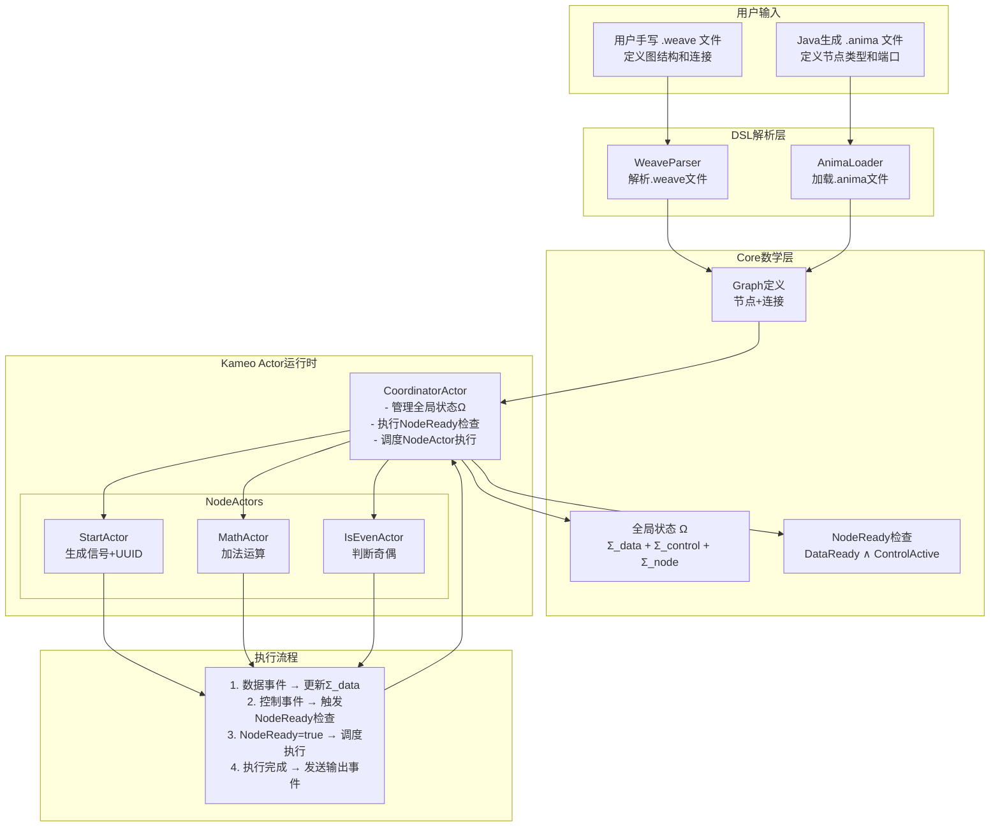

# AnimaWeave Rust 实现进度

## 架构图

## 实现进度

### ✅ Core数学层
- [x] Graph结构 (`graph.rs`)
- [x] Port, Connection, Node定义
- [x] ActivationMode, ConcurrentMode配置
- [x] 事件系统trait (`event.rs`)
- [x] 全局状态trait (`state.rs`) 
- [x] 执行器trait (`executor.rs`)

### ❌ DSL解析层
- [ ] WeaveParser - 解析.weave文件
- [ ] AnimaLoader - 加载.anima文件
- [ ] Graph构建器

### ❌ Actor运行时
- [ ] CoordinatorActor实现
- [ ] NodeActor基础框架
- [ ] StartActor实现
- [ ] MathActor实现
- [ ] IsEvenActor实现

### ❌ 集成测试
- [ ] 端到端执行流程
- [ ] 数学定义验证
- [ ] 性能测试

## 当前状态
- **包结构**: ✅ 编译通过
- **Trait架构**: ✅ 完成
- **下一步**: CoordinatorActor或DSL解析器 