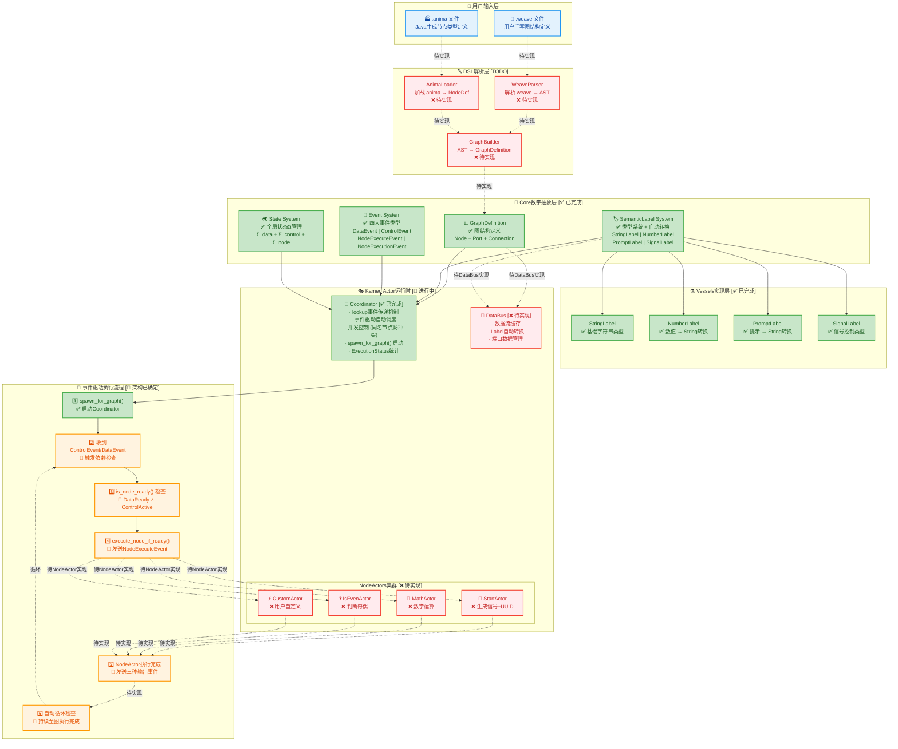
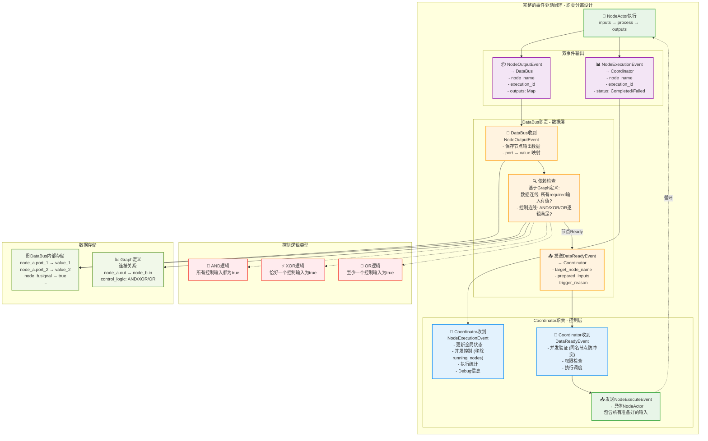

# AnimaWeave Rust 实现进度

## 最新架构图 (2024-12-19更新)

## 实现进度

### ✅ Core数学层
- [x] Graph结构 (`graph.rs`)
- [x] Port, Connection, Node定义
- [x] ActivationMode, ConcurrentMode配置
- [x] **语义标签系统trait** (`label.rs`) - 🆕 完成
- [x] 语义标签宏系统 (`semantic_label!`) - 🆕 完成
- [x] 事件系统trait (`event.rs`) - ⚠️ 需重构以支持SemanticLabel
- [x] 全局状态trait (`state.rs`) 
- [x] 执行器trait (`executor.rs`)

### ✅ Vessels实现层 - 完成
- [x] **StringLabel** - 基础字符串类型，作为转换目标
- [x] **NumberLabel** - 数值类型，可转换为StringLabel
- [x] **PromptLabel** - 提示内容类型，可转换为StringLabel  
- [x] **SignalLabel** - 信号控制类型，可转换为StringLabel
- [x] **完整测试覆盖** - 21个测试用例全部通过
- [x] **自动转换系统** - 支持`try_convert_to()`机制

### ✅ Event系统重构 - 🆕 已完成，职责分离设计
- [x] 识别重构需求：旧`SemanticValue` → 新`SemanticLabel`
- [x] **NodeExecuteEvent**: Coordinator → NodeActor 执行指令
- [x] **NodeExecutionEvent**: NodeActor → Coordinator 状态通知
- [x] **NodeOutputEvent**: NodeActor → DataBus 数据输出
- [x] **DataReadyEvent**: DataBus → Coordinator 依赖满足通知
- [x] EventMeta统一元数据系统，完整的职责分离架构

### ✅ Coordinator Actor - 🆕 已完成
- [x] **Kameo Actor框架集成** - 基于Actor模型的协调器
- [x] **lookup机制** - 完全解耦的事件传递，无循环依赖
- [x] **事件驱动调度** - 自动响应ControlEvent/DataEvent/NodeExecutionEvent
- [x] **并发控制** - 同名节点防冲突，running_nodes管理
- [x] **spawn_for_graph()** - 一次性启动模式，自动注册监听
- [x] **ExecutionStatus** - 完整的执行统计和状态管理
- [x] **GetStatusQuery** - 调试用状态查询接口

### ❌ DSL解析层
- [ ] WeaveParser - 解析.weave文件
- [ ] AnimaLoader - 加载.anima文件
- [ ] Graph构建器

### 🔄 Actor运行时 - 部分完成
- [x] **Coordinator** - 核心协调器已完成
- [ ] **DataBus** - 数据流缓存和转换系统
- [ ] **NodeActor基础框架** - 通用节点执行器
- [ ] **StartActor** - 信号生成节点
- [ ] **MathActor** - 数学运算节点
- [ ] **IsEvenActor** - 判断节点

### ❌ 集成测试
- [ ] 端到端执行流程测试
- [ ] 数学定义验证测试
- [ ] 并发控制测试
- [ ] 性能基准测试

## 🎯 关键成就 - 语义标签系统

### 架构设计原则
- **不可变性**: 语义标签创建后不能修改，只能通过转换创建新标签
- **类型安全**: 通过trait保证类型检查和兼容性验证
- **Actor友好**: 支持Send + Sync，可在Actor间安全传递
- **自主转换**: 语义标签知道如何转换到其他兼容类型

### 职责分离
- **SemanticLabel**: 处理自己的数据维护、转换能力和转换接口
- **Container**: 只做封装和简化，不承担转换逻辑
- **Event系统**: 负责路由时的自动转换协调

### 使用场景
1. **静态分析**: 通过代码扫描、正则匹配等方式提供标签转换关系，用于验证图连接合法性
2. **运行时转换**: Event传递时需要转换为目标标签给下一个节点使用

## 当前状态 (2024-12-19更新)
- **Core基础架构**: ✅ 完全实现，包结构编译通过，21个测试用例通过
- **语义标签系统**: ✅ 完整实现并测试验证，支持自动转换
- **事件系统**: ✅ 四大事件类型完整实现，支持SemanticLabel和统一元数据
- **Coordinator**: ✅ 核心协调器完成，事件驱动架构建立，并发控制实现
- **下一步**: 实现DataBus和NodeActor基础框架

## 🚀 下一阶段重点 (基于职责分离架构)
1. **DataBus智能实现** - 数据存储系统 + 依赖检查引擎 + AND/XOR/OR逻辑计算
2. **Graph连接定义** - 手工定义最小图结构（数据连线 + 控制连线）用于测试  
3. **NodeActor基础框架** - 双事件输出（NodeExecutionEvent + NodeOutputEvent）
4. **DataReadyEvent机制** - DataBus → Coordinator 的智能依赖通知
5. **简单双节点验证** - StartActor → MathActor 完整闭环测试 

graph TD
    subgraph "Event System Architecture"
        subgraph "Core Events"
            DE["DataEvent - source_port: PortRef - data: Box&lt;dyn SemanticLabel&gt;"]
            CE["ControlEvent - source_port: PortRef - signal: SignalLabel"]
            NEE["NodeExecuteEvent - node_name: String - node_execute_id: String"]
            NEV["NodeExecutionEvent - node_name: String - node_execute_id: String - status: NodeStatus"]
        end
        
        subgraph "Actor Flow"
            CA["CoordinatorActor"]
            NA["NodeActor"]
            DB["DataBus"]
        end
        
        subgraph "Event Routing"
            DE --> DB
            CE --> CA
            NEE --> NA
            NEV --> CA
        end
        
        subgraph "Supporting Types"
            PR["PortRef - node_name: String - port_name: String"]
            SL["SignalLabel - active: bool"]
            NS["NodeStatus - Pending - Running - Completed - Failed"]
        end
        
        DE -.-> PR
        CE -.-> PR
        CE -.-> SL
        NEV -.-> NS
    end

    classDef eventClass fill:#e1f5fe
    classDef actorClass fill:#f3e5f5
    classDef typeClass fill:#fff3e0
    
    class DE,CE,NEE,NEV eventClass
    class CA,NA,DB actorClass
    class PR,SL,NS typeClass

graph TB
    %% 用户层
    WeaveFile["📄 .weave 文件 用户定义图结构"]
    AnimaFile["📄 .anima 文件 Vessels生成节点定义"]
    
    %% DSL解析层
    subgraph "🔤 DSL解析层"
        WeaveParser["WeaveParser 解析.weave → AST"]
        AnimaLoader["AnimaLoader 加载.anima → NodeDef"]
        GraphBuilder["GraphBuilder AST → GraphDefinition"]
    end
    
    %% 核心抽象层
    subgraph "🎯 Core抽象层"
        GraphDef["GraphDefinition 抽象图结构"]
        SemanticLabels["SemanticLabel System 类型系统 + 转换"]
        EventSystem["Event System DataEvent + ControlEvent + NodeExecuteEvent"]
    end
    
    %% Actor运行时层
    subgraph "🎭 Kameo Actor运行时"
        CoordActor["🎯 CoordinatorActor · 管理全局状态 Ω · NodeReady检查 · 控制流调度 · 并发控制 · 统计和状态维护"]
        
        DataBus["🚌 DataBus · 数据流处理 · Label转换 · 数据传递"]
        
        subgraph "NodeActors集群"
            StartActor["🚀 StartActor 生成信号+UUID"]
            MathActor["🔢 MathActor 数学运算"]
            IsEvenActor["❓ IsEvenActor 判断奇偶"]
            CustomActor["⚡ CustomActor 用户自定义"]
        end
    end
    
    %% 事件流
    subgraph "📡 事件驱动流程"
        NodeExecuteEvent["⚡ NodeExecuteEvent CoordinatorActor → NodeActor 执行指令"]
        
        DataEvents["📊 DataEvent value + semantic_label source_port + target_port"]
        ControlEvents["🎮 ControlEvent signal + activation_mode node_id + trigger"]
        
        NodeReady["🎲 NodeReady检查 DataReady ∧ ControlActive"]
        
        ExecuteNode["🔄 执行节点 inputs → process → outputs"]
        
        CompletionNotify["✅ 执行完成通知 NodeActor → CoordinatorActor"]
    end
    
    %% 连接关系 - 构建阶段
    WeaveFile --> WeaveParser
    AnimaFile --> AnimaLoader
    WeaveParser --> GraphBuilder
    AnimaLoader --> GraphBuilder
    GraphBuilder --> GraphDef
    
    GraphDef --> CoordActor
    GraphDef --> DataBus
    SemanticLabels --> DataBus
    EventSystem --> CoordActor
    EventSystem --> DataBus
    
    %% 运行时事件流
    CoordActor --> NodeExecuteEvent
    NodeExecuteEvent --> StartActor
    NodeExecuteEvent --> MathActor
    NodeExecuteEvent --> IsEvenActor
    NodeExecuteEvent --> CustomActor
    
    StartActor --> ExecuteNode
    MathActor --> ExecuteNode
    IsEvenActor --> ExecuteNode
    CustomActor --> ExecuteNode
    
    %% 节点执行完成后的事件分流
    ExecuteNode --> DataEvents
    ExecuteNode --> ControlEvents
    ExecuteNode --> CompletionNotify
    
    %% 事件路由
    DataEvents --> DataBus
    ControlEvents --> CoordActor
    CompletionNotify --> CoordActor
    
    %% DataBus处理数据流
    DataBus --> NodeReady
    
    %% CoordinatorActor处理控制流
    CoordActor --> NodeReady
    
    %% 反馈循环
    NodeReady -.-> CoordActor
    
    %% 样式
    classDef actorStyle fill:#e1f5fe,stroke:#01579b,stroke-width:2px
    classDef eventStyle fill:#f3e5f5,stroke:#4a148c,stroke-width:2px
    classDef coreStyle fill:#e8f5e8,stroke:#1b5e20,stroke-width:2px
    
    class CoordActor,DataBus,StartActor,MathActor,IsEvenActor,CustomActor actorStyle
    class NodeExecuteEvent,DataEvents,ControlEvents,CompletionNotify eventStyle
    class GraphDef,SemanticLabels,EventSystem coreStyle

graph TD
    subgraph "Event System Architecture - Final Implementation"
        subgraph "Core Events (with EventMeta)"
            DE["DataEvent + meta: EventMeta + source_port: PortRef + data: Box&lt;dyn SemanticLabel&gt;"]
            CE["ControlEvent + meta: EventMeta + source_port: PortRef + signal: SignalLabel"]
            NEE["NodeExecuteEvent + meta: EventMeta + node_name: NodeName + node_execute_id: ExecutionId + inputs: NodeInputs"]
            NEV["NodeExecutionEvent + meta: EventMeta + node_name: NodeName + node_execute_id: ExecutionId + status: NodeStatus"]
        end
        
        subgraph "Actor Flow"
            CA["CoordinatorActor"]
            NA["NodeActor"]
            DB["DataBus"]
        end
        
        subgraph "Event Routing"
            DE --> DB
            CE --> CA
            NEE --> NA
            NEV --> CA
        end
        
        subgraph "System Types (core/src/types.rs)"
            NN["NodeName = String"]
            PN["PortName = String"] 
            EID["ExecutionId = String"]
            NI["NodeInputs = HashMap&lt;PortName, Box&lt;dyn SemanticLabel&gt;&gt;"]
        end
        
        subgraph "Event Types (event/types.rs)"
            PR["PortRef + node_name: NodeName + port_name: PortName"]
            EM["EventMeta + event_id: String + timestamp: SystemTime + source: Option&lt;String&gt;"]
            NS["NodeStatus - Pending | Running - Completed | Failed(String)"]
        end
        
        subgraph "Core Labels"
            SL["SignalLabel + active: bool"]
            SML["SemanticLabel trait"]
        end
        
        NEE -.-> NI
        DE -.-> PR
        CE -.-> PR
        CE -.-> SL
        NEV -.-> NS
        All_Events -.-> EM
    end

    classDef eventClass fill:#e1f5fe
    classDef actorClass fill:#f3e5f5  
    classDef typeClass fill:#fff3e0
    classDef coreClass fill:#e8f5e8
    
    class DE,CE,NEE,NEV eventClass
    class CA,NA,DB actorClass
    class NN,PN,EID,NI,PR,EM,NS typeClass
    class SL,SML coreClass

graph TB
    subgraph "NodeA 执行完成后的完整事件流"
        NodeA["⚡ NodeActor 执行业务逻辑 inputs → process → outputs"]
        
        DataEvent["📦 DataEvent 数据输出事件 端口数据结果"]
        StateEvent["📊 NodeExecutionEvent 状态通知事件 执行完成/失败"]
        ControlEvent["🎛️ ControlEvent 控制信号事件 Signal激活/停止"]
        
        NodeA -->|"产生数据输出"| DataEvent
        NodeA -->|"报告执行状态"| StateEvent
        NodeA -->|"发出控制信号"| ControlEvent
    end
    
    subgraph "三种事件的不同去向"
        DataBus["🚌 DataBus 数据仓库 缓存端口数据"]
        Coordinator["🎯 Coordinator 状态管理器 NodeReady检查"]
        Coordinator2["🎯 Coordinator 控制流管理 处理Signal"]
        
        DataEvent -->|"存储到"| DataBus
        StateEvent -->|"通知状态"| Coordinator
        ControlEvent -->|"更新控制流"| Coordinator2
    end
    
    subgraph "Coordinator 的主动查询"
        Coordinator3["🎯 Coordinator 收到事件后主动检查"]
        DataBus2["🚌 DataBus 被动响应查询"]
        
        Coordinator3 -->|"查询NodeB输入数据 DataReady(NodeB,Ω)?"| DataBus2
        Coordinator3 -->|"检查NodeB控制状态 ControlActive(NodeB,Ω)?"| Coordinator3
        DataBus2 -->|"返回缓存数据状态"| Coordinator3
        
        Coordinator3 -->|"如果Ready 发送NodeExecuteEvent"| NextNode["⚡ NodeB"]
    end
    
    Coordinator -.-> Coordinator3
    Coordinator2 -.-> Coordinator3
    DataBus -.-> DataBus2

    classDef node fill:#e8f5e8,stroke:#388e3c,stroke-width:2px
    classDef event fill:#fff3e0,stroke:#f57c00,stroke-width:2px
    classDef actor fill:#e3f2fd,stroke:#1976d2,stroke-width:2px
    classDef bus fill:#f3e5f5,stroke:#7b1fa2,stroke-width:2px
    
    class NodeA,NextNode node
    class DataEvent,StateEvent,ControlEvent event
    class Coordinator,Coordinator2,Coordinator3 actor
    class DataBus,DataBus2 bus

## 职责分离架构图 (2024-12-19)

