# AnimaWeave Rust 实现进度

## 架构图

```mermaid
graph TB
    subgraph "用户输入"
        WeaveFile["用户手写 .weave 文件<br/>定义图结构和连接"]
        AnimaFile["Java生成 .anima 文件<br/>定义节点类型和端口"]
    end

    subgraph "DSL解析层"
        WeaveParser["WeaveParser<br/>解析.weave文件"]
        AnimaLoader["AnimaLoader<br/>加载.anima文件"]
    end

    subgraph "Core数学层"
        Omega["全局状态 Ω<br/>Σ_data + Σ_control + Σ_node"]
        GraphDef["Graph定义<br/>节点+连接"]
        NodeReady["NodeReady检查<br/>DataReady ∧ ControlActive"]
        SemanticLabels["语义标签系统<br/>StringLabel + NumberLabel<br/>+ PromptLabel + SignalLabel"]
    end

    subgraph "Vessels实现层"
        StringLabel["StringLabel<br/>基础字符串类型"]
        NumberLabel["NumberLabel<br/>数值类型 → String"]
        PromptLabel["PromptLabel<br/>提示类型 → String"]
        SignalLabel["SignalLabel<br/>信号类型 → String"]
    end

    subgraph "Kameo Actor运行时"
        CoordActor["CoordinatorActor<br/>- 管理全局状态Ω<br/>- 执行NodeReady检查<br/>- 调度NodeActor执行"]
        
        subgraph "NodeActors"
            StartActor["StartActor<br/>生成信号+UUID"]
            MathActor["MathActor<br/>加法运算"]
            IsEvenActor["IsEvenActor<br/>判断奇偶"]
        end
    end

    subgraph "执行流程"
        EventFlow["1. 数据事件 → 更新Σ_data<br/>2. 控制事件 → 触发NodeReady检查<br/>3. NodeReady=true → 调度执行<br/>4. 执行完成 → 发送输出事件<br/>5. 自动Label转换"]
    end

    WeaveFile --> WeaveParser
    AnimaFile --> AnimaLoader
    WeaveParser --> GraphDef
    AnimaLoader --> GraphDef
    
    GraphDef --> CoordActor
    CoordActor --> Omega
    CoordActor --> NodeReady
    
    SemanticLabels --> StringLabel
    SemanticLabels --> NumberLabel
    SemanticLabels --> PromptLabel
    SemanticLabels --> SignalLabel
    
    CoordActor --> StartActor
    CoordActor --> MathActor  
    CoordActor --> IsEvenActor
    
    StartActor --> EventFlow
    MathActor --> EventFlow
    IsEvenActor --> EventFlow
    EventFlow --> CoordActor
```

## 实现进度

### ✅ Core数学层
- [x] Graph结构 (`graph.rs`)
- [x] Port, Connection, Node定义
- [x] ActivationMode, ConcurrentMode配置
- [x] **语义标签系统trait** (`label.rs`) - 🆕 完成
- [x] 语义标签宏系统 (`semantic_label!`) - 🆕 完成
- [x] 事件系统trait (`event.rs`) - ⚠️ 需重构以支持SemanticLabel
- [x] 全局状态trait (`state.rs`) 
- [x] 执行器trait (`executor.rs`)

### ✅ Vessels实现层 - 🆕 新增
- [x] **StringLabel** - 基础字符串类型，作为转换目标
- [x] **NumberLabel** - 数值类型，可转换为StringLabel
- [x] **PromptLabel** - 提示内容类型，可转换为StringLabel  
- [x] **SignalLabel** - 信号控制类型，可转换为StringLabel
- [x] **完整测试覆盖** - 21个测试用例全部通过
- [x] **自动转换系统** - 支持`try_convert_to()`机制

### 🔄 Event系统重构 - 🆕 进行中
- [x] 识别重构需求：旧`SemanticValue` → 新`SemanticLabel`
- [ ] DataEvent支持SemanticLabel自动转换
- [ ] ControlEvent集成SignalLabel  
- [ ] Actor间Label兼容性检查
- [ ] Event路由时的自动转换机制

### ❌ DSL解析层
- [ ] WeaveParser - 解析.weave文件
- [ ] AnimaLoader - 加载.anima文件
- [ ] Graph构建器

### ❌ Actor运行时
- [ ] CoordinatorActor实现
- [ ] NodeActor基础框架
- [ ] StartActor实现
- [ ] MathActor实现
- [ ] IsEvenActor实现

### ❌ 集成测试
- [ ] 端到端执行流程
- [ ] 数学定义验证
- [ ] 性能测试

## 🎯 关键成就 - 语义标签系统

### 架构设计原则
- **不可变性**: 语义标签创建后不能修改，只能通过转换创建新标签
- **类型安全**: 通过trait保证类型检查和兼容性验证
- **Actor友好**: 支持Send + Sync，可在Actor间安全传递
- **自主转换**: 语义标签知道如何转换到其他兼容类型

### 职责分离
- **SemanticLabel**: 处理自己的数据维护、转换能力和转换接口
- **Container**: 只做封装和简化，不承担转换逻辑
- **Event系统**: 负责路由时的自动转换协调

### 使用场景
1. **静态分析**: 通过代码扫描、正则匹配等方式提供标签转换关系，用于验证图连接合法性
2. **运行时转换**: Event传递时需要转换为目标标签给下一个节点使用

## 当前状态
- **包结构**: ✅ 编译通过，21个测试用例通过
- **语义标签系统**: ✅ 完整实现并测试验证
- **下一步**: 重构Event系统支持SemanticLabel，然后实现CoordinatorActor

## 🚀 下一阶段重点
1. **Event系统重构** - 替换`SemanticValue`为`SemanticLabel`，支持自动转换
2. **Actor通信机制** - 实现Actor间的Label兼容性检查和转换
3. **简单执行图验证** - 构建最小可行的双流执行示例 

graph TD
    subgraph "Event System Architecture"
        subgraph "Core Events"
            DE["DataEvent - source_port: PortRef - data: Box&lt;dyn SemanticLabel&gt;"]
            CE["ControlEvent - source_port: PortRef - signal: SignalLabel"]
            NEE["NodeExecuteEvent - node_name: String - node_execute_id: String"]
            NEV["NodeExecutionEvent - node_name: String - node_execute_id: String - status: NodeStatus"]
        end
        
        subgraph "Actor Flow"
            CA["CoordinatorActor"]
            NA["NodeActor"]
            DB["DataBus"]
        end
        
        subgraph "Event Routing"
            DE --> DB
            CE --> CA
            NEE --> NA
            NEV --> CA
        end
        
        subgraph "Supporting Types"
            PR["PortRef - node_name: String - port_name: String"]
            SL["SignalLabel - active: bool"]
            NS["NodeStatus - Pending - Running - Completed - Failed"]
        end
        
        DE -.-> PR
        CE -.-> PR
        CE -.-> SL
        NEV -.-> NS
    end

    classDef eventClass fill:#e1f5fe
    classDef actorClass fill:#f3e5f5
    classDef typeClass fill:#fff3e0
    
    class DE,CE,NEE,NEV eventClass
    class CA,NA,DB actorClass
    class PR,SL,NS typeClass

graph TB
    %% 用户层
    WeaveFile["📄 .weave 文件 用户定义图结构"]
    AnimaFile["📄 .anima 文件 Vessels生成节点定义"]
    
    %% DSL解析层
    subgraph "🔤 DSL解析层"
        WeaveParser["WeaveParser 解析.weave → AST"]
        AnimaLoader["AnimaLoader 加载.anima → NodeDef"]
        GraphBuilder["GraphBuilder AST → GraphDefinition"]
    end
    
    %% 核心抽象层
    subgraph "🎯 Core抽象层"
        GraphDef["GraphDefinition 抽象图结构"]
        SemanticLabels["SemanticLabel System 类型系统 + 转换"]
        EventSystem["Event System DataEvent + ControlEvent + NodeExecuteEvent"]
    end
    
    %% Actor运行时层
    subgraph "🎭 Kameo Actor运行时"
        CoordActor["🯠CoordinatorActor · 管ç†å…¨å±€çŠ¶æ€ Ω · NodeReady检查 · æ§åˆ¶æµè°ƒåº¦ · 并å‘æ§åˆ¶ · 统计和状æ€ç»´æŠ¤"]
        
        DataBus["🚌 DataBus · 数据流处理 Â· Labelè½¬æ¢ Â· 数据传递"]
        
        subgraph "NodeActors集群"
            StartActor["🚀 StartActor 生成信号+UUID"]
            MathActor["🔢 MathActor 数学运算"]
            IsEvenActor["❓ IsEvenActor 判断奇偶"]
            CustomActor["⚡ CustomActor 用户自定义"]
        end
    end
    
    %% 事件流
    subgraph "📡 事件驱动流程"
        NodeExecuteEvent["⚡ NodeExecuteEvent CoordinatorActor → NodeActor 执行指令"]
        
        DataEvents["📊 DataEvent value + semantic_label source_port + target_port"]
        ControlEvents["🮠ControlEvent signal + activation_mode node_id + trigger"]
        
        NodeReady["🲠NodeReady检查 DataReady ∧ ControlActive"]
        
        ExecuteNode["🔄 执行节点 inputs → process → outputs"]
        
        CompletionNotify["✅ 执行完成通知 NodeActor → CoordinatorActor"]
    end
    
    %% 连接关系 - 构建阶段
    WeaveFile --> WeaveParser
    AnimaFile --> AnimaLoader
    WeaveParser --> GraphBuilder
    AnimaLoader --> GraphBuilder
    GraphBuilder --> GraphDef
    
    GraphDef --> CoordActor
    GraphDef --> DataBus
    SemanticLabels --> DataBus
    EventSystem --> CoordActor
    EventSystem --> DataBus
    
    %% 运行时事件流
    CoordActor --> NodeExecuteEvent
    NodeExecuteEvent --> StartActor
    NodeExecuteEvent --> MathActor
    NodeExecuteEvent --> IsEvenActor
    NodeExecuteEvent --> CustomActor
    
    StartActor --> ExecuteNode
    MathActor --> ExecuteNode
    IsEvenActor --> ExecuteNode
    CustomActor --> ExecuteNode
    
    %% 节点执行完成后的事件分流
    ExecuteNode --> DataEvents
    ExecuteNode --> ControlEvents
    ExecuteNode --> CompletionNotify
    
    %% 事件路由
    DataEvents --> DataBus
    ControlEvents --> CoordActor
    CompletionNotify --> CoordActor
    
    %% DataBus处理数据流
    DataBus --> NodeReady
    
    %% CoordinatorActor处理控制流
    CoordActor --> NodeReady
    
    %% 反馈循环
    NodeReady -.-> CoordActor
    
    %% 样式
    classDef actorStyle fill:#e1f5fe,stroke:#01579b,stroke-width:2px
    classDef eventStyle fill:#f3e5f5,stroke:#4a148c,stroke-width:2px
    classDef coreStyle fill:#e8f5e8,stroke:#1b5e20,stroke-width:2px
    
    class CoordActor,DataBus,StartActor,MathActor,IsEvenActor,CustomActor actorStyle
    class NodeExecuteEvent,DataEvents,ControlEvents,CompletionNotify eventStyle
    class GraphDef,SemanticLabels,EventSystem coreStyle

graph TD
    subgraph "Event System Architecture - Final Implementation"
        subgraph "Core Events (with EventMeta)"
            DE["DataEvent + meta: EventMeta + source_port: PortRef + data: Box&lt;dyn SemanticLabel&gt;"]
            CE["ControlEvent + meta: EventMeta + source_port: PortRef + signal: SignalLabel"]
            NEE["NodeExecuteEvent + meta: EventMeta + node_name: NodeName + node_execute_id: ExecutionId + inputs: NodeInputs"]
            NEV["NodeExecutionEvent + meta: EventMeta + node_name: NodeName + node_execute_id: ExecutionId + status: NodeStatus"]
        end
        
        subgraph "Actor Flow"
            CA["CoordinatorActor"]
            NA["NodeActor"]
            DB["DataBus"]
        end
        
        subgraph "Event Routing"
            DE --> DB
            CE --> CA
            NEE --> NA
            NEV --> CA
        end
        
        subgraph "System Types (core/src/types.rs)"
            NN["NodeName = String"]
            PN["PortName = String"] 
            EID["ExecutionId = String"]
            NI["NodeInputs = HashMap&lt;PortName, Box&lt;dyn SemanticLabel&gt;&gt;"]
        end
        
        subgraph "Event Types (event/types.rs)"
            PR["PortRef + node_name: NodeName + port_name: PortName"]
            EM["EventMeta + event_id: String + timestamp: SystemTime + source: Option&lt;String&gt;"]
            NS["NodeStatus - Pending | Running - Completed | Failed(String)"]
        end
        
        subgraph "Core Labels"
            SL["SignalLabel + active: bool"]
            SML["SemanticLabel trait"]
        end
        
        NEE -.-> NI
        DE -.-> PR
        CE -.-> PR
        CE -.-> SL
        NEV -.-> NS
        All_Events -.-> EM
    end

    classDef eventClass fill:#e1f5fe
    classDef actorClass fill:#f3e5f5  
    classDef typeClass fill:#fff3e0
    classDef coreClass fill:#e8f5e8
    
    class DE,CE,NEE,NEV eventClass
    class CA,NA,DB actorClass
    class NN,PN,EID,NI,PR,EM,NS typeClass
    class SL,SML coreClass

graph TB
    subgraph "NodeA 执行完成后的完整事件流"
        NodeA["⚡ NodeActor 执行业务逻辑 inputs → process → outputs"]
        
        DataEvent["📦 DataEvent 数据输出事件 端口数据结果"]
        StateEvent["📊 NodeExecutionEvent 状态通知事件 执行完成/失败"]
        ControlEvent["🎛️ ControlEvent 控制信号事件 Signal激活/停止"]
        
        NodeA -->|"产生数据输出"| DataEvent
        NodeA -->|"报告执行状态"| StateEvent
        NodeA -->|"发出控制信号"| ControlEvent
    end
    
    subgraph "三种事件的不同去向"
        DataBus["🚌 DataBus 数据仓库 缓存端口数据"]
        Coordinator["🯠Coordinator 状æ€ç®¡ç†å™¨ NodeReady检查"]
        Coordinator2["🯠Coordinator æ§åˆ¶æµç®¡ç† 处ç†Signal"]
        
        DataEvent -->|"存储到"| DataBus
        StateEvent -->|"通知状态"| Coordinator
        ControlEvent -->|"更新控制流"| Coordinator2
    end
    
    subgraph "Coordinator 的主动查询"
        Coordinator3["🯠Coordinator 收到事件å主动检查"]
        DataBus2["🚌 DataBus 被动响应查询"]
        
        Coordinator3 -->|"查询NodeBè¾“å…¥æ•°æ® DataReady(NodeB,Ω)?"| DataBus2
        Coordinator3 -->|"检查NodeB控制状态 ControlActive(NodeB,Ω)?"| Coordinator3
        DataBus2 -->|"返回缓存数据状态"| Coordinator3
        
        Coordinator3 -->|"如果Ready 发送NodeExecuteEvent"| NextNode["⚡ NodeB"]
    end
    
    Coordinator -.-> Coordinator3
    Coordinator2 -.-> Coordinator3
    DataBus -.-> DataBus2

    classDef node fill:#e8f5e8,stroke:#388e3c,stroke-width:2px
    classDef event fill:#fff3e0,stroke:#f57c00,stroke-width:2px
    classDef actor fill:#e3f2fd,stroke:#1976d2,stroke-width:2px
    classDef bus fill:#f3e5f5,stroke:#7b1fa2,stroke-width:2px
    
    class NodeA,NextNode node
    class DataEvent,StateEvent,ControlEvent event
    class Coordinator,Coordinator2,Coordinator3 actor
    class DataBus,DataBus2 bus