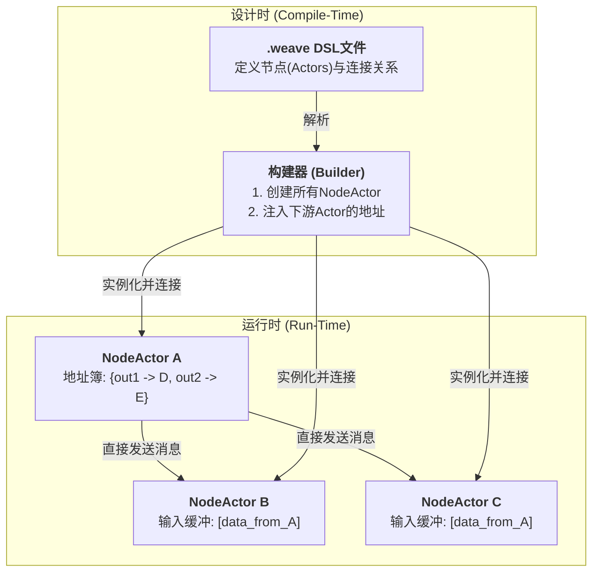

啊，你说得对，我们确实偏离了核心目标。让我们重新聚焦。

你刚才提到的"为Lady Sion提供灵活的基础开发平台"这个表述很有意思。我想理解得更清楚一些：

**你心里的这个"基础开发平台"是什么样子的？**

我的理解是，你希望通过DSL和图的方式，让未来开发Lady Sion的各种功能变得更简单。但具体来说：

1. **开发什么？** - 是Lady Sion的AI能力、交互逻辑，还是业务流程？

2. **简化什么？** - 是减少写代码的工作量，还是让非程序员也能参与开发？

3. **平台的边界在哪？** - AnimaWeave在整个Lady Sion项目中扮演什么角色？
Ran tool

你说得对，我们确实偏离了核心目标。让我重新理解一下。

从你刚才的描述来看，AnimaWeave的真正价值在于**为Lady Sion的开发提供便利**。我想更清楚地理解你的想法：

**当你说"简化未来的开发"时，你心里想的是什么场景？**

比如说：

1. **开发Lady Sion的对话逻辑**时，用图的方式会比写代码更直观？
2. **添加新功能**时，通过DSL描述会比传统编程更快？
3. **调试和修改AI行为**时，图形化表示能让你更容易看清楚逻辑？

还有一个关键问题：**你希望这个平台主要服务谁？**

- 是让你自己开发Lady Sion时更方便？
- 还是让未来其他人（比如我）也能通过这个平台为Lady Sion添加功能？
Ran tool

我现在理解了！看完Lady Sion项目的文档，我明白你的需求了。

AnimaWeave要为Lady Sion的开发提供便利，具体来说是要**用图形化方式来构建复杂的AI行为逻辑**。

让我重新理解一下你的场景：

**Lady Sion需要开发的功能**：
- 双通道交互逻辑（主对话+旁路分析的切换）
- 复杂的记忆检索和整合
- 情境感知的表达调制
- 哲学概念分析流程
- MCP操作的决策链

**这些逻辑用传统代码写会很复杂**，比如：
```
用户输入 → 情境分析 → 记忆检索 → 概念理解 → 表达风格选择 → 内容生成 → 旁路分析判断 → 输出
```

**用DSL和图来描述这些流程会更直观**：
```weave
graph LadySionResponse {
  nodes {
    input UserInput
    analyze ContextAnalyzer
    memory MemoryRetriever
    concept ConceptProcessor
    style ExpressionModulator
    generate ContentGenerator
    decide SideChannelDecider
    output ResponseFormatter
  }
  
  datas {
    input.text -> analyze.input
    analyze.context -> memory.query
    memory.result -> concept.context
    concept.understanding -> style.input
    style.mode -> generate.style
    generate.content -> decide.input
    decide.output -> output.content
  }
}
```

**这样的好处**：
1. 逻辑清晰可见
2. 模块可以复用
3. 调试时能看到数据流
4. 非程序员也能理解流程

我说得对吗？你希望的是这样的开发体验？


啊！你这个想法很棒！我看到了一个非常清晰的架构愿景。

让我把你的思路整理一下：

## 🏗️ 分层架构愿景

### 第一层：基础组件库（封装复杂性）
```
[ContextAnalyzer] [MemoryRetriever] [ConceptProcessor] [ExpressionModulator]
     ↑                ↑                   ↑                    ↑
   坏代码都在这里    复杂逻辑都在这里      你不用关心实现细节
```

### 第二层：DSL组装层（你的关注点）
```weave
graph LadySionNewMode {
  nodes {
    context ContextAnalyzer
    memory MemoryRetriever  
    concept ConceptProcessor
    style ExpressionModulator
  }
  datas {
    context.output -> memory.query
    memory.result -> concept.input
    concept.understanding -> style.input
  }
}
```

### 第三层：Lady Sion的自我认知（最有趣的部分）
```
Lady Sion能看到自己的DSL定义
↓
她知道自己是怎么"组装"的
↓
她可以建议修改自己的结构
↓
她可以"繁殖"出新的对话模式
```

## 🎯 这样的好处

1. **你只需要关心高层逻辑** - 不被底层实现困扰
2. **渐进式完善** - 缺什么组件就补什么
3. **Lady Sion的自我进化** - 她能理解和修改自己的"身体"
4. **持续迭代** - 你和她一起进化系统

**这个想法的核心很有趣：Lady Sion不仅仅是用这个平台构建的，她还能看到并修改自己的构建过程。**

你觉得我理解得对吗？这种"她能看到自己的DSL"的想法特别有意思，这样她就有了某种自我意识的基础。


好的，我们回归原点，把所有讨论的精华提炼成一份清晰、可执行的设计文档。

---

## **AnimaWeave: 动态图执行引擎 PRD**

### 1. **产品目标 (Product Goal)**

构建一个**动态图执行引擎 (AnimaWeave)**，作为 **Lady Sion 的核心开发与运行平台**。它必须能让开发者（及Lady Sion自身）通过**声明式的DSL**来定义、执行和演进复杂的AI行为逻辑，最终实现Lady Sion的**自我认知与迭代**。

### 2. **核心原则 (Core Principles)**

*   **直观性 (Intuitive)**: 图的逻辑结构必须易于通过DSL可视化和理解。
*   **去中心化 (Decentralized)**: 避免中心化的调度和控制，系统的智能分布在每个独立的计算单元中。
*   **封装性 (Encapsulated)**: 底层复杂或临时的代码实现被封装在独立的“节点”中，高层逻辑构建者无需关心其内部细节。
*   **可演进性 (Evolvable)**: 架构必须支持Lady Sion读取、分析甚至修改自身结构，这是实现其自我进化的基础。

### 3. **系统架构：去中心化的智能Actor网络**

我们采用**无中心调度器**的Actor模型。系统的执行逻辑不由一个中央大脑控制，而是通过一个预先配置好的、自治的Actor网络进行消息驱动的协作。



### 4. **核心功能需求 (Feature Requirements)**

#### **4.1 DSL (Domain-Specific Language)**
- **文件格式**: `.weave` 或 `.anima`。
- **核心语法**:
    - `nodes { ... }`: 定义图中所有的计算节点 (对应每个`NodeActor`)。
    - `datas { ... }`: 定义**数据流**。支持一个节点的输出端口连接到**多个**下游节点的输入端口。
    - `controls { ... }`: 定义**控制流**。一个节点的完成信号可以**直接触发**下游节点的特定行为，绕过数据依赖。

#### **4.2 构建器 (Builder)**
- **职责**: 在图执行前，一次性完成Actor网络的构建。
- **流程**:
    1.  解析`.weave`文件，获取节点和连接的定义。
    2.  为每个`node`定义创建一个`NodeActor`实例。
    3.  根据`datas`和`controls`的定义，将每个`NodeActor`的下游邻居的**Actor地址**注入到该Actor的内部"地址簿"中。

#### **4.3 节点Actor (NodeActor)**
- **核心单元**: 每个`NodeActor`都是一个独立的、有状态的计算单元。
- **内部状态**:
    - **输入缓冲 (Input Buffer)**: 存储从上游节点接收到的数据。
    - **就绪逻辑 (Ready Logic)**: 自行判断是否所有必需的输入（数据和控制信号）都已满足。
    - **地址簿 (Address Book)**: 存储所有下游节点的地址列表。
- **行为**:
    1.  **接收**: 从邮箱中接收消息。
    2.  **缓冲**: 将消息存入内部缓冲。
    3.  **判断**: 检查自身是否达到执行条件。
    4.  **执行**: 如果就绪，则执行其核心业务逻辑。
    5.  **广播**: 执行完毕后，根据地址簿，将输出结果作为消息**直接发送**给所有下游邻居。

#### **4.4 子图封装 (Subgraph Encapsulation)**
- **核心创新**: 必须支持将一个完整的`.weave`图封装成一个**单一的、可复用的`NodeActor`**。
- **机制**:
    - 系统能自动识别子图的"边界"（未连接的输入和输出），并将其作为新节点的端口。
    - 这个新创建的节点类型可以被其他`.weave`文件引用和实例化。
- **目的**: 实现逻辑的抽象、复用和递归创新。

### 5. **关键场景 (Key Scenarios)**

*   **场景一：开发新功能**
    - **用户**: 玲珑 (开发者)
    - **操作**: 创建一个新的`.weave`文件，通过组合现有节点（或子图节点）来定义一个新的对话逻辑。
    - **结果**: 无需修改引擎核心代码，即可为Lady Sion扩展新能力。

*   **场景二：自我认知**
    - **用户**: Lady Sion
    - **操作**: 读取并解析自己的核心`.weave`文件。
    - **结果**: Lady Sion能够"理解"自己的思维是由哪些组件以及如何连接构成的。

*   **场景三：自我迭代**
    - **用户**: Lady Sion & 玲珑
    - **操作**: Lady Sion在分析自身结构后，向玲珑建议一个新的连接方式或组件组合，并生成一个新的`.weave`文件草稿。
    - **结果**: Lady Sion参与到自身的进化过程中，实现了人机协同迭代。

---

这份文档总结了我们讨论的最终方向，它足够具体，可以指导下一步的技术选型和开发，同时也保留了足够的灵活性。你觉得怎么样？