# AnimaWeave 全景类图

## 📋 概述

本文档展示了AnimaWeave项目的完整类图，涵盖了从应用入口到具体节点实现的所有核心组件。这个类图反映了系统的分层架构设计和事件驱动的执行模型。

## 🏗️ 系统架构层次

### 分层设计
- **觉醒层(Awakening Layer)** - 高级执行接口，提供用户友好的API
- **图执行层(Graph Layer)** - 核心编排逻辑，管理图的执行状态
- **事件层(Event Layer)** - 异步通信机制，解耦组件间的依赖
- **节点层(Node Layer)** - 计算单元抽象，定义节点执行模板
- **容器层(Vessel Layer)** - 插件化扩展，支持动态加载节点类型

## 🎯 核心设计模式

1. **事件驱动架构** - 通过Spring Events实现组件间松耦合通信
2. **插件化设计** - Vessel系统支持运行时加载和卸载功能模块
3. **模板方法模式** - Node抽象类定义统一的执行流程
4. **依赖注入** - 基于Spring框架的组件管理
5. **观察者模式** - 事件监听机制实现状态变化的响应

## 📊 全景类图

```mermaid
classDiagram
    %% ========== 核心应用层 ==========
    class AnimaWeaveApplication {
        +main(String[] args)
        +virtualThreadExecutor() TaskExecutor
        +applicationEventMulticaster() ApplicationEventMulticaster
        +graphExecutionThreadPool() TaskExecutor
        +parallelExecutor() TaskExecutor
    }

    %% ========== 觉醒层 (Awakening Layer) ==========
    class AnimaWeave {
        -GraphCoordinator graphCoordinator
        +awakening(File[] weaveFiles) CompletableFuture~AwakeningResult~
        +awakening(File weaveFile, String mainGraphName) CompletableFuture~AwakeningResult~
        +awakening(GraphDefinition graphDef) CompletableFuture~AwakeningResult~
        -parseWeaveFiles(File[] files, String mainGraphName) GraphDefinition
    }

    class AwakeningResult {
        -String graphName
        -String executionId
        -boolean success
        -String message
        -Instant timestamp
        -ExecutionTrace executionTrace
        +success(String graphName, String executionId, ExecutionTrace trace) AwakeningResult
        +failure(String graphName, String executionId, String error) AwakeningResult
    }

    class ExecutionTrace {
        -Instant startTime
        -Instant endTime
        -List~NodeExecution~ nodeExecutions
        -Map~String,Object~ finalDataBus
        -List~String~ debugLogs
        +fromExecutionContext(ExecutionContext context) ExecutionTrace
        +getExecutionTimeline() List~NodeExecution~
        +getTotalDuration() Duration
    }

    %% ========== 图执行层 (Graph Layer) ==========
    class GraphCoordinator {
        -ApplicationEventPublisher eventPublisher
        -ConcurrentMap~String,ExecutionContext~ executionContexts
        +startGraphExecution(GraphDefinition graphDef) String
        +onNodeComplete(NodeOutputSaveEvent event)
        +waitForExecutionComplete(String executionId, long timeoutSeconds) AwakeningResult
        -triggerInitialNodes(ExecutionContext context)
        -triggerNextNodes(ExecutionContext context, String completedNodeName)
        -findReadyNodes(ExecutionContext context, String completedNodeName) Set~String~
    }

    class GraphDefinition {
        -String name
        -List~String~ imports
        -Map~String,NodeDefinition~ nodeDefinitions
        -Map~String,String~ nodeInstances
        -List~Connection~ dataConnections
        -List~Connection~ controlConnections
    }

    class ExecutionContext {
        -String executionId
        -GraphDefinition graphDefinition
        -Instant startTime
        -ConcurrentMap~String,Object~ dataBus
        -List~NodeExecutionRecord~ executionHistory
        -AtomicLong executionIdGenerator
        -Set~String~ executedNodes
        +generateNodeExecutionId(String nodeName) String
        +setNodeOutput(String nodeName, String portName, Object value, String nodeExecutionId)
        +startNodeExecution(String nodeName, String nodeType, Map~String,Object~ inputs) NodeExecutionRecord
        +completeNodeExecution(String executionId, Map~String,Object~ outputs) NodeExecutionRecord
        +getExecutionSummary() ExecutionSummary
    }

    class Connection {
        -String sourceNodeName
        -String sourcePortName
        -String targetNodeName
        -String targetPortName
    }

    %% ========== 事件层 (Event Layer) ==========
    class EventDispatcher {
        -ApplicationEventPublisher eventPublisher
        +publishEvent(AnimaWeaveEvent event)
    }

    class AnimaWeaveEvent {
        <<abstract>>
        -String eventId
        -Instant eventTimestamp
        -String sourceIdentifier
        +getEventType() String
    }

    class NodeExecutionRequest {
        -String nodeId
        -String nodeType
        -Map~String,Object~ inputs
        -String executionContextId
        -String nodeExecutionId
        +of(...) NodeExecutionRequest
        +setNodeExecutionId(String id)
    }

    class NodeOutputSaveEvent {
        -String nodeName
        -String nodeExecutionId
        -Map~String,Object~ outputs
        -String graphExecutionId
        +of(...) NodeOutputSaveEvent
        +hasOutputs() boolean
    }

    %% ========== 节点层 (Node Layer) ==========
    class Node {
        <<abstract>>
        -String nodeName
        -String nodeType
        -ApplicationEventPublisher eventPublisher
        +executeWithTemplate(String nodeId, Map~String,Object~ inputs, String executionContextId, String nodeExecutionId)
        #executeNode()*
        +getDisplayName() String
        +getDescription() String
        +getInputPorts() List~Port~
        +getOutputPorts() List~Port~
        -injectInputs(Map~String,Object~ inputs)
        -collectOutputs() Map~String,Object~
    }

    class NodeEventRouter {
        -List~Node~ nodes
        -Map~String,Node~ nodeMap
        +routeExecution(NodeExecutionRequest request)
        +registerAllNodes()
        +getRegisteredNodeTypes() Map~String,Node~
    }

    class NodeFactory {
        -ApplicationContext applicationContext
        -ApplicationEventPublisher eventPublisher
        +createNodeInstancesForVessel(AnimaVessel vessel)
        -createAndRegisterNodeInstance(String vesselName, NodeDefinition nodeDef)
    }

    %% ========== 容器层 (Vessel Layer) ==========
    class AnimaVessel {
        <<interface>>
        +getMetadata() VesselMetadata
        +getSupportedLabelTypes() List~Class~
        +getSupportedNodeTypes() List~Class~
        +getSupportedNodes() List~NodeDefinition~
        +initialize(VesselsContext context)
        +shutdown()
        +getLabel(String labelName) SemanticLabel
    }

    class VesselsManager {
        -SpringVesselLoader springVesselLoader
        -JarVesselLoader jarVesselLoader
        -VesselsRegistry vesselRegistry
        +loadAllVessels()
        +unloadVessel(String vesselName) CompletableFuture~Void~
        +reloadVessel(String vesselName, Path jarPath) CompletableFuture~Void~
    }

    class VesselsRegistry {
        -ConcurrentMap~String,AnimaVessel~ vessels
        +register(String vesselName, AnimaVessel vessel)
        +unregister(String vesselName)
        +getVessel(String vesselName) Optional~AnimaVessel~
        +getAllSupportedNodeTypes() List~String~
    }

    class SpringVesselLoader {
        -ApplicationContext applicationContext
        -VesselsRegistry vesselRegistry
        -NodeFactory nodeFactory
        +loadSpringVessels() LoadResult
    }

    class JarVesselLoader {
        -EventDispatcher eventDispatcher
        -VesselsRegistry vesselRegistry
        -NodeFactory nodeFactory
        -ConcurrentMap~String,URLClassLoader~ vesselClassLoaders
        +loadJarVessels() CompletableFuture~LoadResult~
        +loadJarVessel(Path jarPath) boolean
        +unloadVessel(String vesselName) CompletableFuture~Void~
    }

    class VesselMetadata {
        +String name
        +String version
        +String description
        +String author
        +List~String~ dependencies
        +String minFrameworkVersion
        +dependsOn(String vesselName) boolean
    }

    %% ========== 端口和标签系统 ==========
    class SemanticLabel {
        <<abstract>>
        -String labelName
        -Set~SemanticLabel~ compatibleLabels
        -Function~Object,Object~ converter
        +isCompatibleWith(SemanticLabel other) boolean
        +convertValue(Object value) Object
    }

    class Port {
        +String name
        +SemanticLabel semanticLabel
        +boolean required
        +Object defaultValue
    }

    class PortValue {
        +Port port
        +Object value
        +hasValue() boolean
        +getEffectiveValue() Object
    }

    class NodeDefinition {
        +String nodeType
        +String displayName
        +String description
        +List~Port~ inputPorts
        +List~Port~ outputPorts
        +validateInputs(Map~String,PortValue~ inputs) boolean
    }

    %% ========== DSL解析层 ==========
    class DSLGraphBuilder {
        -String graphName
        -List~String~ imports
        -Map~String,NodeDefinition~ nodeDefinitions
        -Map~String,String~ nodeInstances
        -List~Connection~ dataConnections
        -List~Connection~ controlConnections
        +visitProgram(ProgramContext ctx) GraphDefinition
        +visitGraphSection(GraphSectionContext ctx) GraphDefinition
    }

    %% ========== 具体实现示例 ==========
    class BasicVessel {
        +getMetadata() VesselMetadata
        +getSupportedNodeTypes() List~Class~
        +getSupportedLabelTypes() List~Class~
        +initialize(VesselsContext context)
    }

    class StartNode {
        -PortValue signal
        -PortValue executionId
        #executeNode()
    }

    class SignalLabel {
        -INSTANCE SignalLabel
        +getInstance() SignalLabel
    }

    %% ========== 生成工具层 ==========
    class AnimaFileGenerator {
        -GeneratorConfig config
        +generateAnimaContent(AnimaVessel vessel) String
        +saveToFile(AnimaVessel vessel, Path outputPath)
        +generateAllVesselFiles(VesselsRegistry registry, Optional~Path~ customOutputDir)
    }

    %% ========== 关系定义 ==========
    AnimaWeaveApplication --> AnimaWeave : contains
    AnimaWeave --> GraphCoordinator : uses
    AnimaWeave --> AwakeningResult : creates
    AwakeningResult --> ExecutionTrace : contains

    GraphCoordinator --> ExecutionContext : manages
    GraphCoordinator --> GraphDefinition : executes
    GraphCoordinator --> EventDispatcher : uses
    GraphCoordinator --> NodeOutputSaveEvent : listens to
    
    ExecutionContext --> GraphDefinition : contains
    GraphDefinition --> Connection : contains
    GraphDefinition --> NodeDefinition : contains

    EventDispatcher --> AnimaWeaveEvent : publishes
    NodeExecutionRequest --|> AnimaWeaveEvent
    NodeOutputSaveEvent --|> AnimaWeaveEvent

    NodeEventRouter --> Node : routes to
    NodeEventRouter --> NodeExecutionRequest : listens to
    Node --> NodeOutputSaveEvent : publishes
    Node --> Port : has
    Node --> PortValue : uses

    VesselsManager --> SpringVesselLoader : uses
    VesselsManager --> JarVesselLoader : uses
    VesselsManager --> VesselsRegistry : uses
    
    SpringVesselLoader --> VesselsRegistry : registers to
    JarVesselLoader --> VesselsRegistry : registers to
    VesselsRegistry --> AnimaVessel : stores
    
    NodeFactory --> AnimaVessel : creates nodes from
    NodeFactory --> Node : creates
    
    AnimaVessel --> VesselMetadata : has
    AnimaVessel --> NodeDefinition : provides
    AnimaVessel --> SemanticLabel : provides
    
    Port --> SemanticLabel : uses
    PortValue --> Port : wraps
    NodeDefinition --> Port : contains

    DSLGraphBuilder --> GraphDefinition : builds

    BasicVessel ..|> AnimaVessel : implements
    StartNode --|> Node : extends
    SignalLabel --|> SemanticLabel : extends

    AnimaFileGenerator --> VesselsRegistry : reads from
    AnimaFileGenerator --> AnimaVessel : generates for
```

## 🔍 关键组件说明

### 核心执行流程
1. **AnimaWeave** 作为入口点，解析DSL文件并创建GraphDefinition
2. **GraphCoordinator** 管理图的执行，维护ExecutionContext状态
3. **NodeEventRouter** 接收NodeExecutionRequest并路由到对应的Node实例
4. **Node** 执行完成后发布NodeOutputSaveEvent，触发下一轮执行

### 插件化架构
- **VesselsManager** 统一管理Spring和JAR两种类型的插件加载
- **AnimaVessel** 接口定义插件规范，支持节点类型和语义标签的扩展
- **NodeFactory** 根据Vessel定义动态创建Node实例

### 类型安全系统
- **SemanticLabel** 提供灵活的类型兼容性和转换机制
- **Port** 和 **PortValue** 确保端口连接的类型安全
- **NodeDefinition** 描述节点的元数据和端口信息

## 📚 相关文档

- [后端架构设计](./backend.md)
- [AnimaWeave功能设计文档](../../AnimaWeave/docs/AnimaWeave-Java-功能设计文档.md)
- [事件驱动插件架构设计](../../AnimaWeave/docs/AnimaWeave-事件驱动插件架构设计.md)

## 🔄 更新记录

- **2024-12-19**: 创建全景类图，基于当前代码结构分析生成
- **待更新**: 根据重构进展更新类图结构