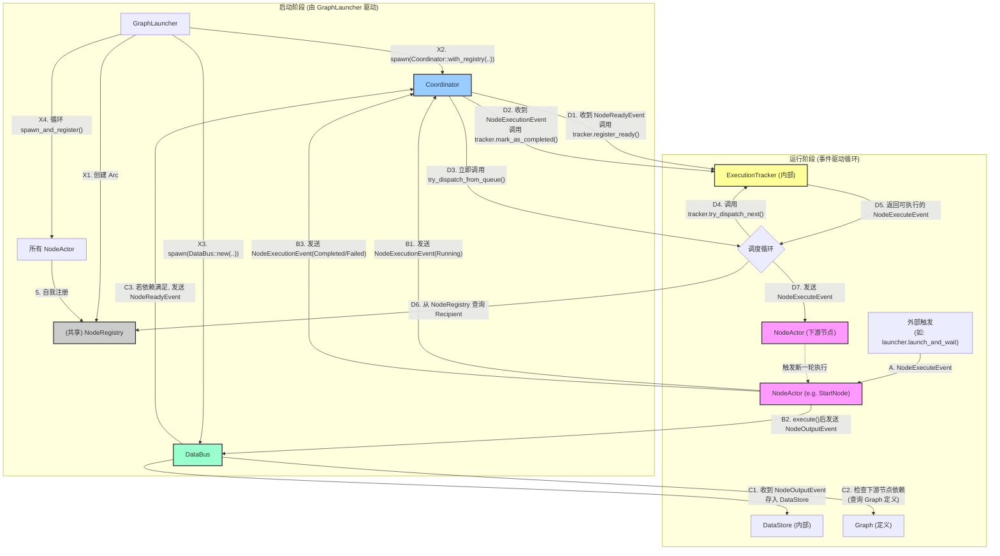

# AnimaWeave 系统核心流程图

这是对 AnimaWeave 事件驱动系统的核心工作流程的描绘，基于2024年7月28日对代码的逐行分析确认。

该图分为两个主要阶段：**启动阶段** 和 **运行阶段**。

## 流程图

## 图解说明

-   **启动阶段**: `GraphLauncher` 像一个工头，初始化了所有核心服务 (`Coordinator`, `DataBus`, `NodeRegistry`)，并创建了所有的 `NodeActor` 工人。工人们被创建后，会自己去 `NodeRegistry` 这个"花名册"上登记。
-   **运行阶段**:
    1.  一切始于一个外部触发（步骤 A），比如我们测试中的 `launch_and_wait`，它向一个起始节点（如 `StartNode`）发送了第一个 `NodeExecuteEvent`。
    2.  节点执行（步骤 B）：收到执行命令的 `NodeActor` 会立刻向 `Coordinator` 报告"我开工了"，执行完后把"产出"交给 `DataBus`，并向 `Coordinator` 报告"我完工了/失败了"。
    3.  `DataBus` 路由（步骤 C）：`DataBus` 收到"产出"后，会查询图纸（`Graph`），看看这个产出能满足哪些下游节点的"配方"。如果某个下游节点的所有配料都齐了，它就向 `Coordinator` 报告"那个节点可以开工了"。
    4.  `Coordinator` 调度（步骤 D）：`Coordinator` 收到 `DataBus` 的"可以开工"通知，或者某个节点的"完工"通知后，都会去问 `ExecutionTracker`："现在谁可以动？" `ExecutionTracker` 会根据并发规则返回一个可以执行的节点。`Coordinator` 再从"花名册"里找到这个节点的联系方式，给它发送执行命令，从而形成一个闭环。 

graph TD
    subgraph "完整的事件驱动闭环 - 职责分离设计"
        NodeExec["🔄 NodeActor执行 inputs → process → outputs"]
        
        subgraph "双事件输出"
            ExecutionEvent["📊 NodeExecutionEvent → Coordinator - node_name - execution_id - status: Completed/Failed"]
            NodeOutputEvent["📦 NodeOutputEvent → DataBus - node_name - execution_id - outputs: Map<port,value>"]
        end
        
        NodeExec --> ExecutionEvent
        NodeExec --> NodeOutputEvent
        
        subgraph "Coordinator职责 - 控制层"
            CoordReceiveExec["🎯 Coordinator收到NodeExecutionEvent - 更新全局状态 - 并发控制 (移除running_nodes) - 执行统计 - Debug信息"]
            
            CoordReceiveReady["🎯 Coordinator收到DataReadyEvent - 并发验证 (同名节点防冲突) - 权限检查 - 执行调度"]
            
            SendExecute["📤 发送NodeExecuteEvent → 具体NodeActor 包含所有准备好的输入"]
        end
        
        ExecutionEvent --> CoordReceiveExec
        
        subgraph "DataBus职责 - 数据层"
            DataBusReceive["🚌 DataBus收到NodeOutputEvent - 保存节点输出数据 - port → value 映射"]
            
            DependencyCheck["🔍 依赖检查 基于Graph定义: - 数据连线: 所有required输入有值? - 控制连线: AND/XOR/OR逻辑满足?"]
            
            SendReady["📤 发送DataReadyEvent → Coordinator - target_node_name - prepared_inputs - trigger_reason"]
        end
        
        NodeOutputEvent --> DataBusReceive
        DataBusReceive --> DependencyCheck
        DependencyCheck -->|"节点Ready"| SendReady
        SendReady --> CoordReceiveReady
        CoordReceiveReady --> SendExecute
        SendExecute -.->|"循环"| NodeExec
    end
    
    subgraph "控制逻辑类型"
        AndLogic["🔀 AND逻辑 所有控制输入都为true"]
        XorLogic["⚡ XOR逻辑 恰好一个控制输入为true"]
        OrLogic["🌊 OR逻辑 至少一个控制输入为true"]
        
        DependencyCheck -.-> AndLogic
        DependencyCheck -.-> XorLogic
        DependencyCheck -.-> OrLogic
    end
    
    subgraph "数据存储"
        DataStore["🗄️ DataBus内部存储 node_a.port_1 → value_1 node_a.port_2 → value_2 node_b.signal → true ..."]
        GraphDef["📊 Graph定义 连接关系: node_a.out → node_b.in control_logic: AND/XOR/OR"]
        
        DataBusReceive --> DataStore
        DependencyCheck --> DataStore
        DependencyCheck --> GraphDef
    end
    
    classDef nodeStyle fill:#e8f5e8,stroke:#4caf50,stroke-width:2px
    classDef coordStyle fill:#e3f2fd,stroke:#2196f3,stroke-width:2px
    classDef busStyle fill:#fff3e0,stroke:#ff9800,stroke-width:2px
    classDef eventStyle fill:#f3e5f5,stroke:#9c27b0,stroke-width:2px
    classDef logicStyle fill:#ffebee,stroke:#f44336,stroke-width:2px
    classDef storeStyle fill:#f1f8e9,stroke:#689f38,stroke-width:2px
    
    class NodeExec,SendExecute nodeStyle
    class CoordReceiveExec,CoordReceiveReady coordStyle
    class DataBusReceive,DependencyCheck,SendReady busStyle
    class ExecutionEvent,NodeOutputEvent eventStyle
    class AndLogic,XorLogic,OrLogic logicStyle
    class DataStore,GraphDef storeStyle
