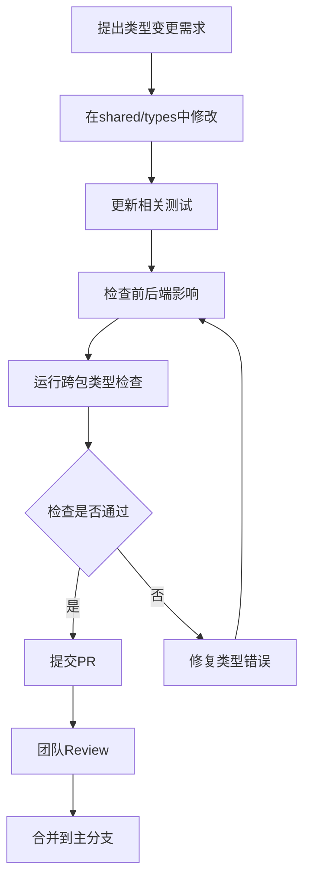

# Monorepo 共享DTO类型系统最佳实践

本文档说明了Lady Sion项目中Monorepo架构下前后端共享DTO类型系统的设计理念、架构优势以及开发最佳实践。

## 🎯 **为什么选择共享DTO类型系统？**

### ✅ **Monorepo架构最佳实践**

基于现代全栈开发和大型项目经验，共享DTO类型系统是2024年monorepo的推荐架构：

1. **类型一致性保证**：前后端使用完全相同的类型定义，避免接口不匹配
2. **开发效率提升**：统一的类型定义减少重复工作和沟通成本
3. **重构安全性**：类型变更在编译时发现问题，而不是运行时
4. **代码质量保障**：强类型约束减少bug产生

### 📊 **架构对比分析**

| 架构模式         | 优势                                                       | 劣势                                            |
| ---------------- | ---------------------------------------------------------- | ----------------------------------------------- |
| **共享DTO类型**  | ✅ 类型一致<br>✅ 重构安全<br>✅ 开发效率<br>✅ 错误早发现 | ❌ 初期设计复杂                                 |
| **分离类型定义** | ✅ 包独立<br>✅ 灵活性高                                   | ❌ 类型不一致<br>❌ 维护复杂<br>❌ 接口同步困难 |

## 🏗️ **共享类型系统架构**

### 目录结构设计

```
LadySion/ (monorepo根目录)
├── shared/                     # 共享代码包
│   └── types/                  # 共享类型定义
│       ├── preset.ts           # 预设相关DTO
│       ├── character.ts        # 角色相关DTO
│       ├── conversation.ts     # 对话相关DTO
│       ├── api.ts             # API通用DTO
│       └── index.ts           # 类型导出入口
├── server/                     # 后端应用
│   └── src/
│       ├── types/             # 后端特有类型
│       └── domain/            # 领域实体（继承共享DTO）
└── web/                        # 前端应用
    └── src/
        └── types/             # 前端特有类型
            └── index.ts       # 重新导出共享类型
```

### 核心设计原则

```typescript
// 1. 基础DTO接口设计
export interface BaseEntity {
  readonly id: string;
  readonly createdAt?: Date;
  readonly updatedAt?: Date;
}

// 2. 枚举优先原则
export enum EntityType {
  PRESET = "preset",
  CHARACTER = "character",
  CONVERSATION = "conversation",
}

// 3. 继承层次设计
export interface ActivatableEntity extends BaseEntity {
  isActive: boolean;
  priority: number;
}

// 4. 类型安全工具
export type EntityByType<T extends EntityType> = T extends EntityType.PRESET ? PresetDTO
  : T extends EntityType.CHARACTER ? CharacterDTO
  : T extends EntityType.CONVERSATION ? ConversationDTO
  : never;
```

### API响应标准化

```typescript
// 统一的API响应格式
export interface ApiResponse<T = any> {
  success: boolean;
  data?: T;
  message?: string;
  error?: {
    code: string;
    message: string;
    details?: unknown;
  };
}

// 分页响应格式
export interface PaginatedResponse<T> extends ApiResponse<T[]> {
  pagination: {
    page: number;
    pageSize: number;
    total: number;
    totalPages: number;
  };
}

// 操作结果格式
export interface OperationResult<T = any> extends ApiResponse<T> {
  affected?: number;
  changes?: string[];
}
```

## 🔧 **开发实践规范**

### 1. **共享类型定义标准**

```typescript
// shared/types/preset.ts

/**
 * 预设类型枚举 - 前后端共享
 */
export enum PresetType {
  /** 指令模式预设 */
  INSTRUCT = "instruct",
  /** 上下文模板预设 */
  CONTEXT = "context",
  /** 系统提示词预设 */
  SYSTEM_PROMPT = "sysprompt",
}

/**
 * 预设DTO - 前后端数据传输对象
 */
export interface PresetDTO extends BaseEntity {
  name: string;
  type: PresetType;
  description?: string;
  content: string;
  enabled: boolean;
  priority: number;
}

/**
 * 创建预设请求DTO
 */
export interface CreatePresetRequestDTO {
  name: string;
  type: PresetType;
  description?: string;
  content: string;
  enabled?: boolean;
  priority?: number;
}

/**
 * 更新预设请求DTO
 */
export interface UpdatePresetRequestDTO extends Partial<CreatePresetRequestDTO> {}
```

### 2. **后端领域实体扩展**

```typescript
// server/src/domain/entities/Preset.ts

import { PresetDTO, PresetType } from "../../../../shared/types/preset";

/**
 * 后端预设领域实体 - 基于共享DTO扩展
 */
export class PresetEntity implements PresetDTO {
  constructor(
    public readonly id: string,
    public name: string,
    public type: PresetType,
    public content: string,
    public enabled: boolean = true,
    public priority: number = 100,
    public description?: string,
    public readonly createdAt?: Date,
    public readonly updatedAt?: Date,
  ) {}

  // 领域特有方法
  activate(): void {
    this.enabled = true;
  }

  deactivate(): void {
    this.enabled = false;
  }

  // 转换为DTO（用于API响应）
  toDTO(): PresetDTO {
    return {
      id: this.id,
      name: this.name,
      type: this.type,
      description: this.description,
      content: this.content,
      enabled: this.enabled,
      priority: this.priority,
      createdAt: this.createdAt,
      updatedAt: this.updatedAt,
    };
  }

  // 从DTO创建实体
  static fromDTO(dto: PresetDTO): PresetEntity {
    return new PresetEntity(
      dto.id,
      dto.name,
      dto.type,
      dto.content,
      dto.enabled,
      dto.priority,
      dto.description,
      dto.createdAt,
      dto.updatedAt,
    );
  }
}
```

### 3. **前端类型扩展和重新导出**

```typescript
// web/src/types/preset.ts

// 重新导出共享类型
export * from "../../../shared/types/preset";

// 前端特有的UI状态扩展
export interface ExtendedPresetDTO extends PresetDTO {
  // UI状态
  isSelected?: boolean;
  loading?: boolean;
  isDirty?: boolean;

  // 统计信息
  usageCount?: number;
  lastUsedAt?: Date;

  // 权限信息
  permissions?: {
    canEdit: boolean;
    canDelete: boolean;
    canExport: boolean;
  };
}

// 前端表单状态类型
export interface PresetFormState {
  data: CreatePresetRequestDTO;
  errors: Record<string, string>;
  touched: Record<string, boolean>;
  isSubmitting: boolean;
}
```

### 4. **API接口类型约束**

```typescript
// server/src/api/routes/preset.ts

import {
  ApiResponse,
  CreatePresetRequestDTO,
  PresetDTO,
  PresetType,
  UpdatePresetRequestDTO,
} from "../../../../shared/types/preset";

// 类型安全的API路由定义
interface PresetRoutes {
  "GET /api/presets": {
    query?: { type?: PresetType; enabled?: boolean };
    response: ApiResponse<PresetDTO[]>;
  };

  "POST /api/presets": {
    body: CreatePresetRequestDTO;
    response: ApiResponse<PresetDTO>;
  };

  "PUT /api/presets/:id": {
    params: { id: string };
    body: UpdatePresetRequestDTO;
    response: ApiResponse<PresetDTO>;
  };

  "DELETE /api/presets/:id": {
    params: { id: string };
    response: ApiResponse<{ deleted: boolean }>;
  };
}
```

## 🚀 **性能优化策略**

### 1. **类型缓存和预计算**

```typescript
// shared/types/constants.ts

// 预计算的类型映射
export const ENTITY_TYPE_LABELS = {
  [EntityType.PRESET]: "预设",
  [EntityType.CHARACTER]: "角色",
  [EntityType.CONVERSATION]: "对话",
} as const;

// 类型验证缓存
const typeValidationCache = new Map<string, boolean>();

export function validateEntityType(value: unknown): value is EntityType {
  const key = String(value);
  if (typeValidationCache.has(key)) {
    return typeValidationCache.get(key)!;
  }

  const isValid = Object.values(EntityType).includes(value as EntityType);
  typeValidationCache.set(key, isValid);
  return isValid;
}
```

### 2. **按需导入和代码分割**

```typescript
// web/src/types/index.ts

// 按模块重新导出，支持tree-shaking
export type { CreatePresetRequestDTO, PresetDTO, PresetType } from "./preset";

export type { CharacterDTO, CharacterType, CreateCharacterRequestDTO } from "./character";

// 懒加载类型定义
export const PresetTypes = () => import("./preset");
export const CharacterTypes = () => import("./character");
```

### 3. **运行时类型验证优化**

```typescript
// shared/types/validation.ts

// 轻量级类型守卫
export const isPresetDTO = (obj: unknown): obj is PresetDTO => {
  return typeof obj === 'object' && 
         obj !== null && 
         'id' in obj && 
         'name' in obj && 
         'type' in obj &&
         validateEntityType((obj as any).type);
};

// 开发环境详细验证
if (process.env.NODE_ENV === 'development') {
  export const validatePresetDTO = (obj: unknown): obj is PresetDTO => {
    // 详细的字段验证逻辑
    // ...
  };
}
```

## 🔍 **开发工具和调试**

### 1. **类型生成工具**

```typescript
// scripts/generate-types.ts

/**
 * 从数据库Schema生成DTO类型
 * 确保数据库结构与DTO类型的一致性
 */
export function generateDTOFromSchema(schemaPath: string): void {
  // 读取数据库schema
  // 生成对应的DTO接口
  // 写入shared/types目录
}

/**
 * 验证现有DTO与数据库schema的一致性
 */
export function validateDTOConsistency(): boolean {
  // 检查DTO定义与数据库schema是否匹配
  // 返回验证结果
}
```

### 2. **开发环境类型检查**

```typescript
// scripts/type-check.ts

/**
 * 检查前后端类型使用的一致性
 */
export function checkCrossPackageTypes(): void {
  // 扫描前后端代码
  // 检查共享类型的使用是否正确
  // 报告不一致的地方
}

// 在CI/CD中运行
if (process.env.NODE_ENV === "ci") {
  checkCrossPackageTypes();
}
```

### 3. **自动化同步工具**

```bash
# package.json scripts
{
  "scripts": {
    "types:check": "tsc --noEmit && npm run types:check:cross",
    "types:check:cross": "node scripts/type-check.js",
    "types:generate": "node scripts/generate-types.js",
    "types:validate": "node scripts/validate-dto.js"
  }
}
```

## 🎓 **团队协作标准**

### 1. **共享类型变更流程**



### 2. **版本管理策略**

```typescript
// shared/types/version.ts

/**
 * 类型版本信息
 */
export const TYPE_SYSTEM_VERSION = "2.1.0";

/**
 * 向后兼容性标记
 */
export interface TypeVersionInfo {
  version: string;
  deprecated?: string[];
  breaking?: string[];
  migration?: string;
}

/**
 * 类型变更历史
 */
export const TYPE_CHANGELOG: TypeVersionInfo[] = [
  {
    version: "2.1.0",
    deprecated: ["PresetTypeString"],
    migration: "docs/guides/type-migration-v2.1.md",
  },
];
```

### 3. **文档注释规范**

````typescript
/**
 * 预设数据传输对象
 *
 * @description 用于前后端预设数据传输的标准格式
 * @version 2.0.0
 * @since 1.0.0
 * @example
 * ```typescript
 * const preset: PresetDTO = {
 *   id: 'uuid-here',
 *   name: '智能助手',
 *   type: PresetType.INSTRUCT,
 *   content: '你是一个有用的AI助手',
 *   enabled: true,
 *   priority: 100
 * };
 * ```
 */
export interface PresetDTO extends BaseEntity {
  // ... 接口定义
}
````

## 🔮 **扩展性和未来规划**

### 1. **多包类型共享**

```typescript
// 支持更多包的类型共享
const packages = ["web", "server", "mobile", "desktop"];

// 自动生成各包的类型导出
packages.forEach((pkg) => {
  generateTypeExports(pkg);
});
```

### 2. **运行时类型验证集成**

```typescript
// 集成Zod等运行时验证库
import { z } from "zod";

// 从DTO接口生成Zod schema
export const PresetDTOSchema = z.object({
  id: z.string(),
  name: z.string(),
  type: z.nativeEnum(PresetType),
  content: z.string(),
  enabled: z.boolean(),
  priority: z.number(),
});

// 类型安全的运行时验证
export function validatePresetDTO(data: unknown): PresetDTO {
  return PresetDTOSchema.parse(data);
}
```

### 3. **GraphQL集成**

```typescript
// 从共享DTO生成GraphQL schema
export function generateGraphQLSchema(): string {
  // 读取共享类型定义
  // 生成对应的GraphQL schema
  // 确保类型一致性
}
```

## 📝 **测试策略**

### 1. **类型一致性测试**

```typescript
// tests/type-consistency.test.ts

describe("前后端类型一致性", () => {
  it("应该在前后端使用相同的DTO类型", () => {
    // 检查前端类型导入是否正确
    // 检查后端实体是否正确实现DTO接口
  });

  it("应该正确验证类型守卫", () => {
    expect(isPresetDTO(validPreset)).toBe(true);
    expect(isPresetDTO(invalidData)).toBe(false);
  });
});
```

### 2. **API契约测试**

```typescript
// tests/api-contract.test.ts

describe("API契约测试", () => {
  it("POST /api/presets 应该接受正确的DTO格式", async () => {
    const requestData: CreatePresetRequestDTO = {
      name: "Test Preset",
      type: PresetType.INSTRUCT,
      content: "Test content",
    };

    const response = await api.post("/api/presets", requestData);

    // 验证响应符合PresetDTO类型
    expect(isPresetDTO(response.data.data)).toBe(true);
  });
});
```

## 📚 **相关资源**

### 内部文档

- [Monorepo架构文档](../architecture/monorepo.md)
- [API设计规范](../api/design-standards.md)
- [前端开发指南](../guides/frontend-development.md)
- [后端开发指南](../guides/backend-development.md)

### 外部参考

- [TypeScript Handbook](https://www.typescriptlang.org/docs/)
- [Monorepo Best Practices](https://monorepo.tools/)
- [API Design Guidelines](https://github.com/microsoft/api-guidelines)

---

**📅 最后更新**: 2024年12月\
**👥 维护者**: Lady Sion 开发团队\
**🔄 版本**: v2.0.0\
**🏷️ 标签**: `monorepo` `typescript` `dto` `shared-types` `best-practices`
