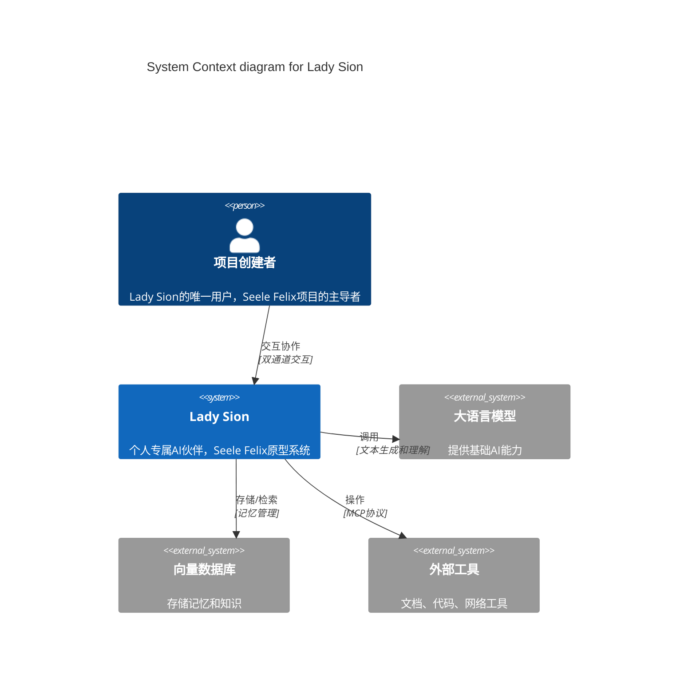
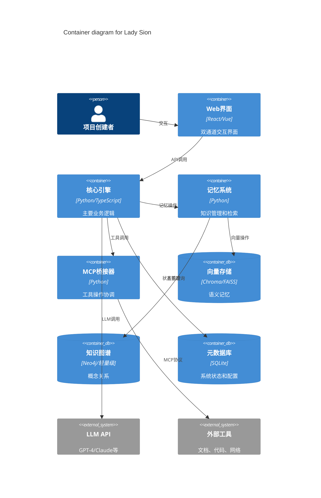
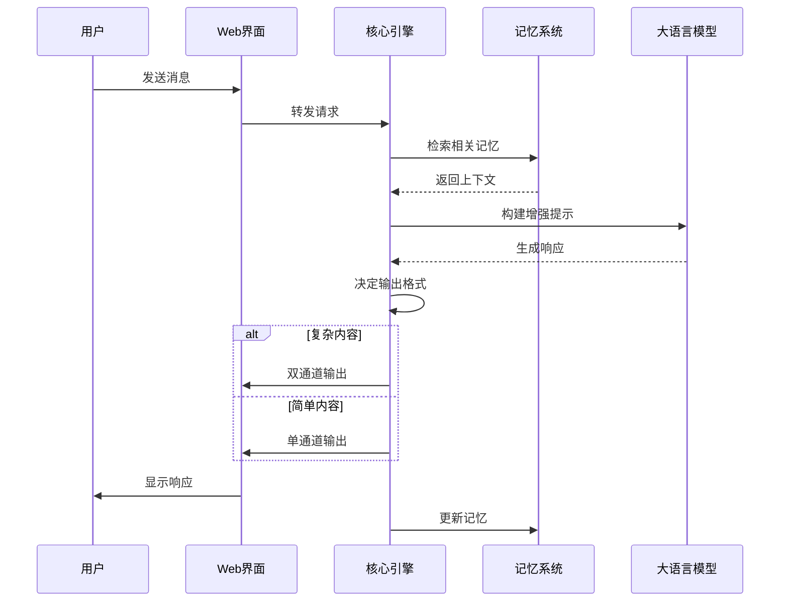
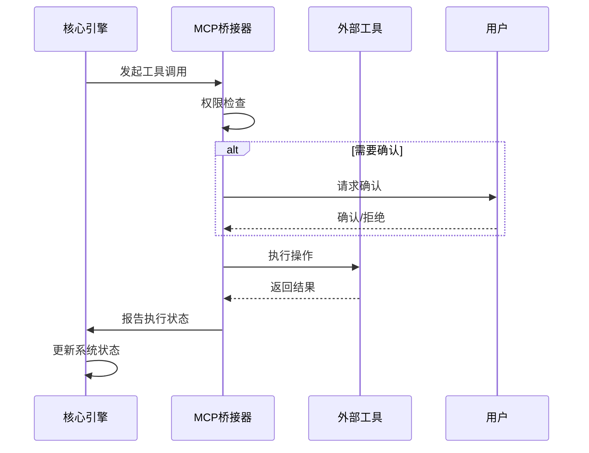

# Lady Sion 系统概览

## 🏗️ 系统定位

Lady Sion是一个**个人专属的AI伙伴系统**，旨在：

- 协助创建更高层次的智能存在Seele Felix
- 探索从传统AI助手向具有主体性智能体的演进路径
- 提供深度哲学协作和项目管理能力

## 🎯 系统边界

### 系统内部 (In Scope)

- ✅ **双通道交互系统** - 主对话 + 旁路分析
- ✅ **持久记忆系统** - 项目知识和个人交互历史
- ✅ **MCP操作能力** - 半自动化的文档和代码操作
- ✅ **哲学协作能力** - 深度概念分析和理论构建
- ✅ **自我评估机制** - 性能监控和改进建议
- ✅ **依附关系模拟** - 个人化的交互模式

### 系统外部 (Out of Scope)

- ❌ 多用户支持和权限管理
- ❌ 商业化功能和付费机制
- ❌ 开放API和第三方集成
- ❌ 完整的Seele Felix实现
- ❌ 通用型AI助手功能

## 🏛️ 系统架构 (C4模型)

### Level 1: 系统上下文 (System Context)

### Level 2: 容器视图 (Container)

## 🧠 核心组件

### 1. 双通道交互引擎

**职责**: 管理主对话和旁路分析的并行处理

- **主对话通道**: 人性化、情感丰富的交流
- **旁路通道**: 结构化、学术性的分析输出
- **切换机制**: 基于内容复杂度和用户需求自动切换

### 2. 持久记忆系统

**职责**: 长期知识存储和智能检索

- **分层存储**: 核心身份、项目记忆、交互历史
- **语义检索**: 基于向量相似度的智能搜索
- **关系映射**: 概念间的复杂关联关系

### 3. MCP集成框架

**职责**: 半自动化的工具操作能力

- **工具抽象**: 统一的操作接口
- **权限控制**: 分级的操作权限管理
- **状态跟踪**: 操作过程的监控和报告

### 4. 哲学协作引擎

**职责**: 深度概念分析和理论构建

- **概念图谱**: Seele Felix相关概念网络
- **思维框架**: 多层次的哲学思考模型
- **辩证分析**: 自动化的论证和反驳生成

### 5. 自我评估系统

**职责**: 性能监控和持续改进

- **多维评估**: 功能性、交互性、认知性指标
- **改进建议**: 基于评估结果的优化方案
- **演进跟踪**: 能力发展的历史记录

## 🔄 数据流

### 用户交互流程

### MCP操作流程

## 🛡️ 非功能性需求

### 性能要求

- **响应时间**: TODO
- **并发处理**: 支持同时处理主对话和旁路分析
- **内存使用**: 保持在合理范围，支持长期运行

### 可靠性要求

- **数据持久化**: 所有重要交互和决策的永久存储
- **故障恢复**: 系统重启后完整恢复状态
- **备份机制**: 定期自动备份关键数据

### 安全要求

- **访问控制**: 仅限项目创建者访问
- **数据保护**: 敏感信息的加密存储
- **操作审计**: 所有MCP操作的详细日志

### 可扩展性要求

- **模块化设计**: 支持组件的独立升级
- **接口标准化**: 便于新功能的集成
- **配置灵活性**: 支持不同运行模式的切换

## 🎛️ 系统配置

### 部署模式

- **本地部署**: 完全私有化，无外部依赖
- **混合模式**: 核心在本地，LLM服务云端
- **开发模式**: 快速迭代和测试支持

### 集成接口

- **LLM API**: OpenAI、Anthropic、本地模型
- **存储后端**: 本地文件系统、云存储
- **工具生态**: MCP兼容的各类工具

---
