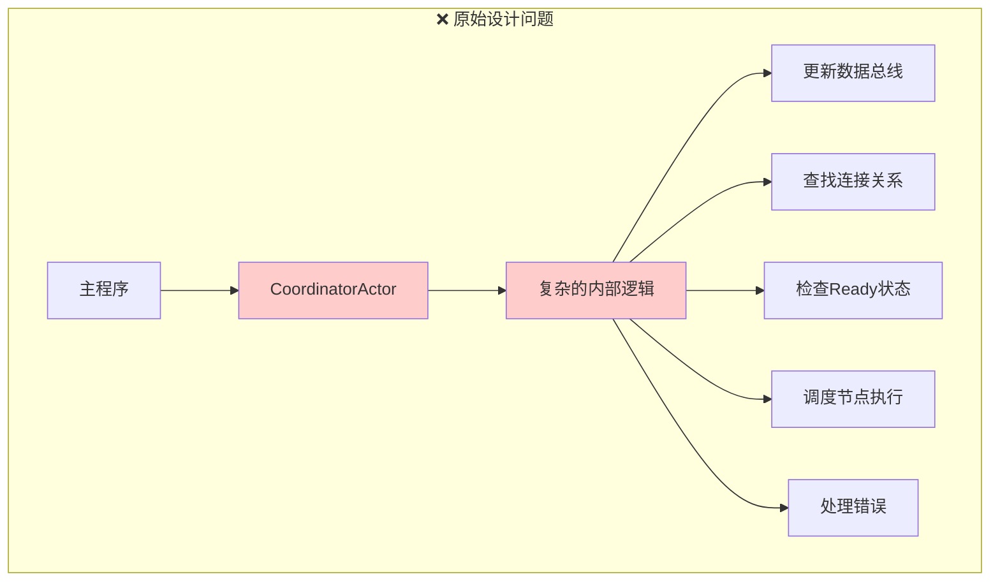
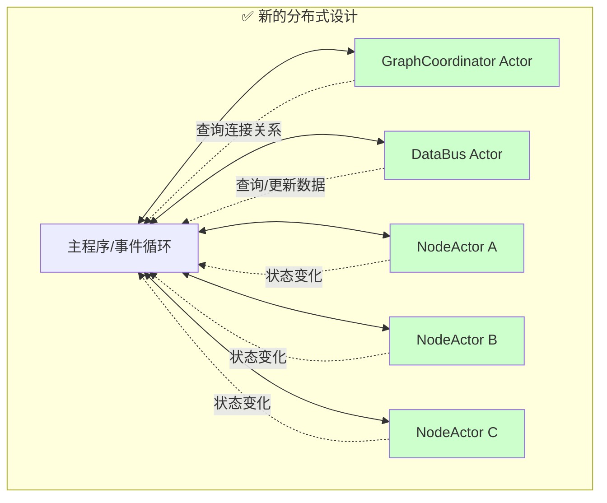
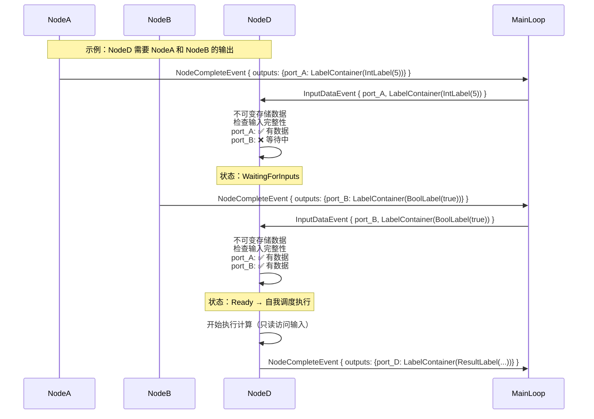
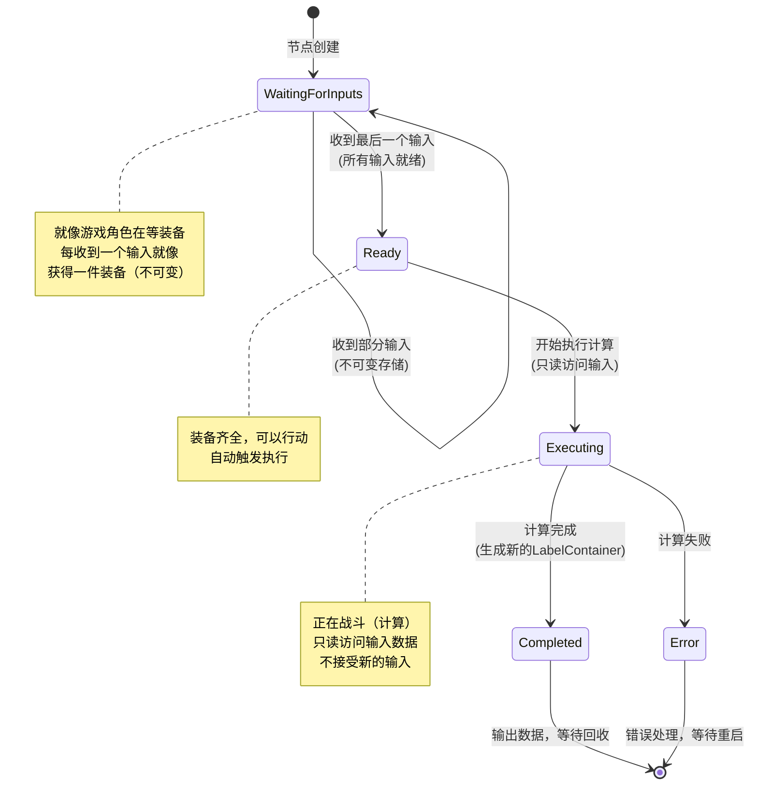
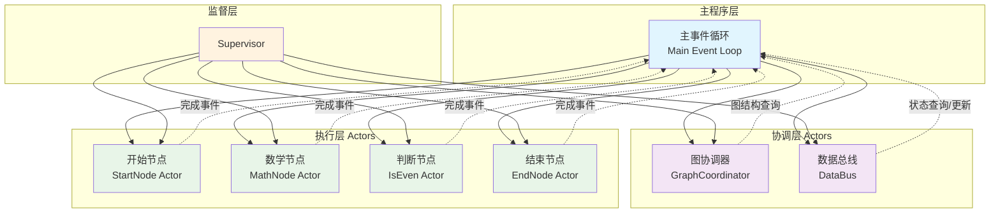

# AnimaWeave Rust Actor 模型设计重构

## 📋 讨论记录
- **时间**: 2025-01-09
- **参与者**: 茜 & 玲珑
- **主题**: AnimaWeave Rust实现的Actor模型架构重新设计

## 🎯 核心发现：当前设计的根本问题

### 问题识别
我们发现原始的 `CoordinatorActor` 设计违背了 Actor 模型的核心原则：

```rust
// ❌ 错误设计：CoordinatorActor 承担过多职责
impl CoordinatorActor {
    async fn handle_node_complete(&mut self, event: NodeCompleteEvent) {
        // 1. 更新数据总线 ← 状态管理
        // 2. 查找连接关系 ← 图遍历
        // 3. 发送事件给下游 ← 消息路由
        // 4. 检查Ready状态 ← 调度决策
        // 5. 执行节点调度 ← 执行控制
        // ... 职责过于复杂！
    }
}
```

### Actor 模型核心原则（来自 Erlang/Kameo 研究）
1. **单一职责** - 每个 Actor 只做一件事
2. **状态封装** - Actor 只管理自己的状态
3. **消息驱动** - 通过外部消息协调，而非内部复杂逻辑
4. **错误隔离** - Actor 失败不影响其他 Actor

## 🏗️ SemanticLabel 语义标签系统设计

### 核心设计原则

```rust
/// 语义标签trait - 对应数学定义中的 ℒ = {Int, Bool, String, Array[T], ...}
/// 
/// 设计原则：
/// 1. 不可变性：语义标签一旦创建就不能修改，只能通过转换创建新的标签
/// 2. 类型安全：通过trait保证类型检查和兼容性验证  
/// 3. Actor友好：支持Send + Sync，可以安全地在Actor间传递
pub trait SemanticLabel: Send + Sync + Debug + 'static {
    fn type_name(&self) -> &'static str;
    fn is_compatible_with(&self, other: &dyn SemanticLabel) -> bool;
    fn as_any(&self) -> &dyn Any;
    fn clone_boxed(&self) -> Box<dyn SemanticLabel>;
}
```

### 在Actor间的使用方式

```rust
// 1. 创建语义标签（在具体的vessel实现中）
#[derive(Debug, Clone)]
pub struct IntLabel(pub i32);

impl SemanticLabel for IntLabel {
    fn type_name(&self) -> &'static str { "Int" }
    // ... 其他实现
}

// 2. NodeActor中接收和处理数据
pub struct MathNodeActor {
    inputs: HashMap<String, Option<LabelContainer>>,
}

impl Actor for MathNodeActor {
    async fn handle_message(&mut self, msg: NodeMessage) {
        match msg {
            NodeMessage::InputData { port_id, data } => {
                // 不可变存储
                println!("收到{}类型数据到端口{}", data.type_name(), port_id);
                self.inputs.insert(port_id, Some(data));
                
                if self.are_all_inputs_ready() {
                    self.schedule_execution().await;
                }
            }
        }
    }
}

// 3. 类型安全的计算和转换
impl MathNodeActor {
    async fn compute(&self) -> LabelContainer {
        // 只读访问输入数据
        let a = self.inputs["input_a"].as_ref().unwrap()
            .downcast_ref::<IntLabel>().unwrap().0;
        let b = self.inputs["input_b"].as_ref().unwrap()
            .downcast_ref::<IntLabel>().unwrap().0;
            
        // 创建新的语义标签作为输出
        create_label(IntLabel(a + b))
    }
    
    // 函数式转换示例
    fn transform_output(&self, input: &LabelContainer) -> LabelContainer {
        input.transform(|old_val| {
            if let Some(int_val) = old_val.downcast_ref::<IntLabel>() {
                create_label(BoolLabel(int_val.0 % 2 == 0))  // 转换为布尔值
            } else {
                panic!("类型不匹配")
            }
        })
    }
}
```

### 语义标签的数学对应关系

| 数学概念 | Rust实现 | 说明 |
|---------|----------|------|
| **ℒ** (语义标签集合) | `SemanticLabel` trait | 所有可能的语义标签类型 |
| **Γ ⊆ ℒ × ℒ** (兼容性关系) | `is_compatible_with()` | 类型兼容性检查 |
| **τ ∈ ℒ** (具体标签) | `LabelContainer` | 类型安全的标签实例 |
| **φ: ∏τᵢ → ∏τₖ** (节点函数) | `NodeActor::compute()` | 节点计算函数 |

## 💡 重构方案：分布式 Actor 架构

### 架构对比图

#### 原始设计（有问题的中央协调器）


#### 新设计（分布式Actor架构）


### 方案概述
将原来的单一 `CoordinatorActor` 拆分为多个专职的 Actor：

```rust
// 🎯 单一职责的 Actor 群
struct GraphCoordinator {
    graph: Graph,
    connections: HashMap<NodeId, Vec<Connection>>,
}

struct DataBus {
    omega: GlobalState, // Ω 全局状态
}

struct NodeActor {
    node_id: NodeId,
    node_def: NodeDefinition,
    input_data: HashMap<PortId, Option<LabelContainer>>,  // 不可变数据存储
    state: NodeState,
}
```

### 关键创新：节点自主状态管理

每个 `NodeActor` 自己管理输入数据的完整性：

```rust
enum NodeState {
    WaitingForInputs,  // 等待输入数据
    Ready,             // 所有输入就绪
    Executing,         // 正在执行
    Completed,         // 执行完成
}

impl NodeActor {
    async fn handle_input_data(&mut self, port_id: PortId, data: LabelContainer) -> Option<ExecuteCommand> {
        // 1. 不可变存储输入数据
        self.input_data.insert(port_id, Some(data));
        
        // 2. 检查是否所有输入都ready了
        if self.are_all_inputs_ready() {
            self.state = NodeState::Ready;
            Some(ExecuteCommand { node_id: self.node_id })  // 自我调度
        } else {
            None  // 继续等待其他输入
        }
    }
}
```

## 🔄 新的事件流设计

### 多输入节点处理流程图



### 事件流程文字描述
```
NodeA 完成 → NodeCompleteEvent (携带LabelContainer)
    ↓
分发数据给下游节点 → InputDataEvent { port_id: A_out, data: LabelContainer }
    ↓
NodeD 接收数据A → 不可变存储，检查：还需要等待数据B
    ↓
NodeB 完成 → NodeCompleteEvent (携带LabelContainer)
    ↓
分发数据给下游节点 → InputDataEvent { port_id: B_out, data: LabelContainer }
    ↓
NodeD 接收数据B → 不可变存储，检查：所有输入就绪！自我调度执行
```

### 优势分析
1. **分布式决策** - 每个节点自己决定何时 ready
2. **无锁并发** - 没有全局状态需要同步
3. **天然容错** - 节点失败只影响自己
4. **符合 Actor 模式** - 清晰的状态和职责分离
5. **不可变数据** - 消除竞态条件，保证数据一致性

## 🎮 类比理解：游戏状态机模式

### NodeActor 状态转换图



### 游戏角色类比
每个节点就像游戏中的角色：
- **等待状态** - 还在等装备（输入数据），装备一旦获得就不会改变
- **准备状态** - 装备齐全，可以行动  
- **执行状态** - 正在战斗（计算），只读使用装备
- **完成状态** - 战斗结束，产出战利品（输出数据）

## 📚 技术研究支撑

### Kameo Actor 框架特点
- 基于 Tokio 的轻量级 Actor
- 类型安全的消息系统
- 内置监督和容错机制
- 分布式通信支持

### Erlang OTP 设计原则
- gen_server 行为模式
- 监督树（Supervision Tree）
- "Let it crash" 哲学
- 消息传递并发模型

## 🚧 待解决的技术挑战

### 1. 消息类型设计
```rust
// 需要定义的核心消息类型
enum SystemMessage {
    NodeCompleteEvent { node_id: NodeId, outputs: HashMap<PortId, LabelContainer> },
    InputDataEvent { target_node: NodeId, port_id: PortId, data: LabelContainer },
    ExecuteCommand { node_id: NodeId },
    // ... 其他消息类型
}
```

### 2. 错误处理和传播
- 节点执行失败时的错误传播策略
- 部分输入缺失时的处理机制
- 监督策略的设计

### 3. 性能优化
- 避免不必要的全图遍历
- 智能的 Ready 状态检查
- 内存效率的数据传递

### 4. 并发执行模式
- Concurrent vs Sequential 执行策略
- 资源限制和背压控制
- 优先级调度机制

### Actor 系统整体架构图



## 🔄 下一步计划

### 短期目标
1. 设计核心消息类型定义
2. 实现基本的 NodeActor 框架
3. 创建简单的多输入节点测试案例
4. 验证分布式状态管理的可行性

### 中期目标  
1. 完整的监督策略实现
2. 性能优化和并发控制
3. 错误处理和恢复机制
4. 与现有 DSL 解析层的集成

### 技术决策记录
- ✅ 选择 Kameo 作为 Actor 框架
- ✅ 采用分布式 Actor 架构替代中央协调器
- ✅ NodeActor 自主管理输入状态
- ✅ SemanticLabel 不可变设计
- 🚧 消息类型设计待完善
- 🚧 监督策略待设计

## 💭 思考和感悟

今天的讨论让我们认识到，**好的架构设计需要回归基本原理**。通过研究 Erlang OTP 和 Kameo 的设计哲学，我们发现了当前设计的根本缺陷，并找到了更符合 Actor 模型本质的解决方案。

**关键洞察**：不是让一个 Actor 承担所有职责，而是让每个 Actor 做好自己的事，通过消息协调实现整体目标。SemanticLabel 的不可变设计进一步保证了系统的安全性和一致性。

---

**下次讨论重点**：
1. 消息类型的具体设计
2. NodeActor 的详细实现
3. 监督策略的选择
4. 性能测试和验证方案 