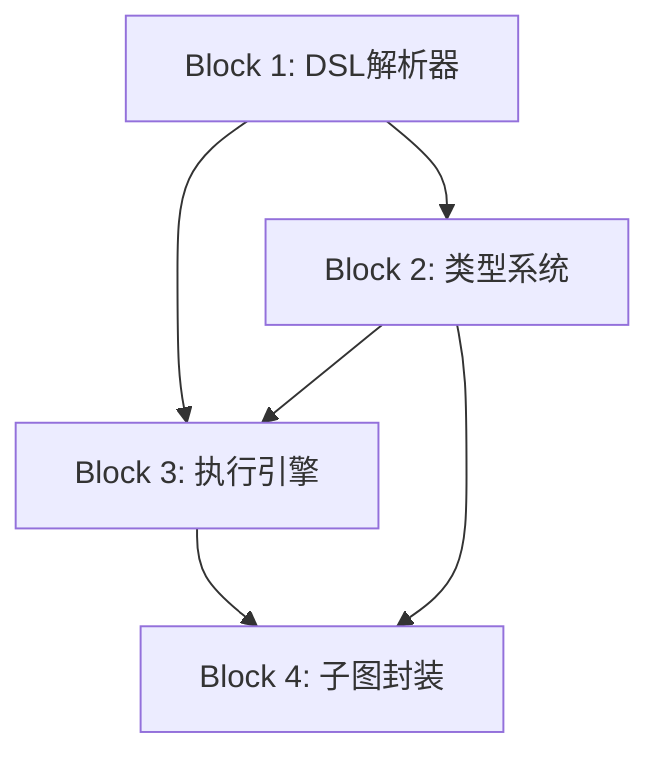

# AnimaWeave DSL框架功能列表

## 📋 项目定位

### 🎯 产品定义
- **用户**：玲珑（个人使用）
- **核心需求**：DSL框架让用户定义和执行节点图
- **技术约束**：必须满足32个数学定义
- **价值定位**：图灵完备的节点图DSL框架
- **差异化竞争点**：子图封装为节点的递归构建能力

### 🏆 竞品分析
- **LangChain/LangGraph**：工作流编排，但缺少子图封装能力
- **Microsoft Semantic Kernel**：AI应用框架，但不是DSL
- **ComfyUI**：节点式UI工具，但专门针对图像生成
- **我们的优势**：子图封装为节点的递归构建能力

---

## 🔥 功能优先级（MoSCoW框架）

### 🟥 Must Have（必须有）- 框架核心

#### M1. DSL语法解析器
**用户故事**：作为用户，我要能写DSL代码定义节点和图
**功能描述**：
- 节点定义：`NodeName { in {...} out {...} }`
- 图定义：`graph { nodes {...} datas {...} controls {...} }`
- 语义标签：`TypeName { CompatibleType1 CompatibleType2 }`
**验收标准**：能解析.anima和.weave文件，生成AST

#### M2. 子图封装机制
**用户故事**：作为用户，我要能把图变成节点来重复使用
**功能描述**：
- 边界端口自动识别
- 子图→节点的封装映射
- 新节点可以在其他图中使用
**验收标准**：定义的子图能作为节点在其他地方调用

#### M3. 语义标签系统
**用户故事**：作为用户，我要系统自动处理数据类型匹配
**功能描述**：
- 基本类型：`int`、`string`、`bool`
- 兼容性声明：`int { double }`
- 连接时自动类型检查
**验收标准**：不兼容类型连接时报错，兼容类型自动转换

#### M4. 图执行引擎
**用户故事**：作为用户，我要能执行定义的图
**功能描述**：
- 数据流传播：`a.out -> b.in`
- 控制流传播：`a.signal -> b.execute`
- 节点就绪检测和执行调度
**验收标准**：图能正确执行，产生预期输出

### 🟨 Should Have（应该有）- 框架增强

#### S1. 静态检查
**用户故事**：作为用户，我要在运行前知道图的问题
**功能描述**：
- 类型兼容性检查
- 连接有效性验证
- 循环依赖检测
**验收标准**：错误的图定义能在编译时被发现

#### S2. 控制流支持
**用户故事**：作为用户，我要控制节点执行的条件和顺序
**功能描述**：
- 激活模式：`mode=AND/OR/XOR`
- 并发控制：`mode Sequential/Concurrent`
- 可选端口：`optional`标记
**验收标准**：能实现条件执行和并发控制

#### S3. 模块导入
**用户故事**：作为用户，我要重用已定义的节点和类型
**功能描述**：
- 文件导入：`import "common.anima"`
- 依赖解析
- 命名空间处理
**验收标准**：能导入和使用外部定义

#### S4. 错误处理
**用户故事**：作为用户，我要知道哪里出错了
**功能描述**：
- 解析错误提示
- 运行时错误追踪
- 错误位置定位
**验收标准**：错误信息能帮助定位问题

### 🟩 Could Have（可以有）- 框架完善

#### C1. 基础节点库
**用户故事**：作为用户，我要一些基础的节点来开始
**功能描述**：
- 数学运算：`Add`、`Multiply`
- 逻辑运算：`And`、`Or`、`Not`
- 数据处理：`Transform`、`Filter`
**验收标准**：提供基本的节点实现

#### C2. 基础语义标签库
**用户故事**：作为用户，我要标准的数据类型
**功能描述**：
- 数值类型：`int`、`double`、`bool`
- 文本类型：`string`
- 集合类型：`array`
**验收标准**：提供基本的类型定义

#### C3. 性能优化
**用户故事**：作为用户，我要框架运行得更快
**功能描述**：
- 并行执行优化
- 内存管理优化
- 编译优化
**验收标准**：执行性能有明显提升

### 🟪 Won't Have（暂不实现）- 明确排除

#### W1. 可视化编辑器
- 图形化界面
- 拖拽操作
- 可视化调试

#### W2. 插件系统
- 动态加载插件
- 插件管理
- 第三方扩展

#### W3. 应用层功能
- AI模型集成
- 具体业务逻辑
- 用户界面

---

## 🎯 第一版MVP功能范围

### 🚀 MVP目标
**一句话描述**：让玲珑能用DSL定义和执行图灵完备的节点图

### 🔧 具体功能
1. **DSL语法解析器**（M1）
2. **子图封装机制**（M2）  
3. **语义标签系统**（M3）
4. **图执行引擎**（M4）

### ✅ 成功标准
能用DSL代码：
- 定义节点和语义标签
- 组合节点为子图
- 封装子图为新节点
- 执行图并得到正确结果

### 📝 示例代码
```weave
// 定义基础计算子图
graph AddTwo {
  nodes {
    add1 Add
    add2 Add
  }
  
  datas {
    add1.result -> add2.b
  }
}

// 使用封装的节点
graph Main {
  nodes {
    calc AddTwo
  }
  
  datas {
    input.a -> calc.add1.a
    input.b -> calc.add1.b
    input.c -> calc.add2.a
  }
}
```

## 🎯 框架边界

### ✅ 框架提供
- DSL语法定义和解析
- 图执行引擎
- 类型系统
- 子图封装机制
- 基础数据类型
- 几个示例节点

### ❌ 框架不提供
- 具体的AI节点实现
- 业务逻辑节点
- 用户界面
- 插件管理
- 第三方集成

---

## 📋 任务拆分

### 🎯 MVP任务大块拆分

基于4个核心功能，拆分为以下大块：

#### 🔤 Block 1: DSL语法解析器
**目标**：让用户能写DSL代码定义节点和图
**依赖**：无
**输出**：AST（抽象语法树）

#### 🏗️ Block 2: 类型系统与语义标签
**目标**：支持语义标签定义和类型检查
**依赖**：Block 1（需要解析类型定义）
**输出**：类型系统和兼容性检查器

#### ⚡ Block 3: 图执行引擎
**目标**：能执行解析后的图
**依赖**：Block 1（需要AST）, Block 2（需要类型检查）
**输出**：可工作的执行引擎

#### 🔄 Block 4: 子图封装机制
**目标**：把图封装为节点的递归能力
**依赖**：Block 1, 2, 3（需要完整的基础设施）
**输出**：子图→节点的封装功能

### 📝 任务执行顺序



**建议顺序**：
1. 先做 Block 1 (DSL解析器)
2. 并行做 Block 2 (类型系统) 
3. 然后做 Block 3 (执行引擎)
4. 最后做 Block 4 (子图封装)

### 🔍 下一步细化方向

你想从哪个Block开始细化任务？我的建议是先从Block 1开始，因为：

1. **Block 1是基础**：其他所有功能都依赖AST
2. **风险最低**：语法解析是相对独立的模块
3. **能快速验证**：可以很快看到解析结果

还是你有其他想法？ 