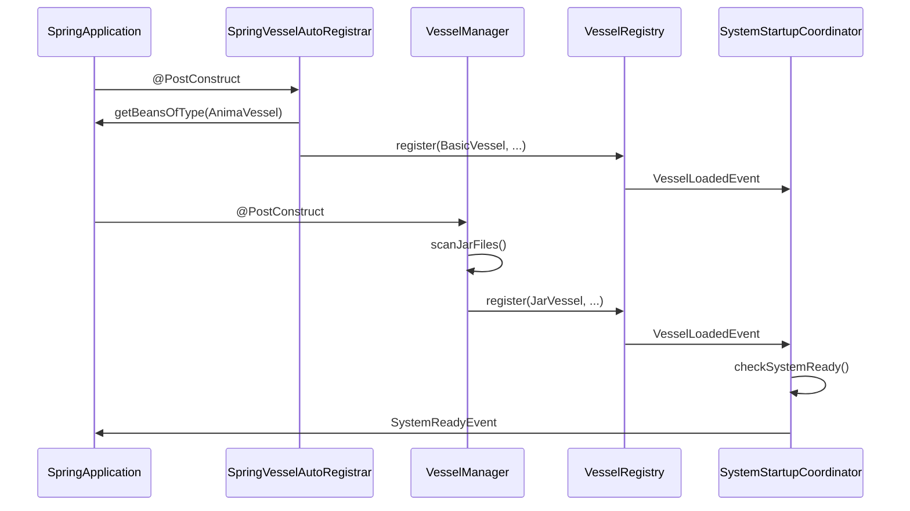

# Vessel架构重构设计文档

## 📋 概述

本文档描述了AnimaWeave框架中vessel加载系统的架构重构，旨在解决当前架构中职责分散、依赖混乱和过度设计的问题。

## 🎯 问题分析

### 当前架构问题

1. **过度设计** - `VesselLoadingStrategy`是不必要的抽象层
2. **职责分散** - `VesselManager`既管JAR加载又管Spring容器发现
3. **重复逻辑** - `AnimaGeneratorCliApp`有独立的vessel发现逻辑
4. **依赖混乱** - 循环依赖和复杂的依赖关系链

### 具体问题代码位置

- `VesselManager` - 依赖过多组件，职责不清
- `VesselLoadingStrategy` - 完全不必要的抽象
- `AnimaGeneratorCliApp` - 重复实现vessel发现

## 🛠️ 重构设计

### 核心原则

1. **职责单一** - 每个组件只负责一种vessel加载方式
2. **依赖简化** - 减少组件间的依赖关系
3. **逻辑统一** - 事件发布等通用逻辑统一处理
4. **配置清晰** - 自动发现机制清晰可控

### 新架构组件

#### 1. VesselManager
**职责**：仅负责JAR文件插件的加载
```java
@Component
public class VesselManager {
    // 只依赖基础服务
    private final VesselRegistry vesselRegistry;
    private final EventDispatcher eventDispatcher;
    private final NodeInstanceFactory nodeInstanceFactory;
    
    @PostConstruct
    public void loadJarVessels() {
        // 只扫描./vessels目录的JAR文件
        // 使用ServiceLoader机制加载
        // 注册到VesselRegistry（自动发布事件）
    }
}
```

#### 2. SpringVesselAutoRegistrar (新增)
**职责**：自动注册Spring容器中的@Component vessel
```java
@Component
public class SpringVesselAutoRegistrar {
    private final VesselRegistry vesselRegistry;
    private final ApplicationContext applicationContext;
    
    @PostConstruct
    public void registerSpringVessels() {
        // 发现所有@Component的AnimaVessel
        // 注册到VesselRegistry（自动发布事件）
    }
}
```

#### 3. VesselRegistryImpl (增强)
**职责**：统一vessel注册和事件发布
```java
@Component
public class VesselRegistryImpl implements VesselRegistry {
    private final EventDispatcher eventDispatcher;
    
    @Override
    public void register(String vesselName, AnimaVessel vessel) {
        // 注册vessel
        vessels.put(vesselName, vessel);
        
        // 统一发布VesselLoadedEvent
        publishVesselLoadedEvent(vesselName, vessel);
    }
}
```

#### 4. AnimaGeneratorCliApp (简化)
**职责**：纯粹的工具应用，复用现有机制
```java
public class AnimaGeneratorCliApp implements CommandLineRunner {
    private final AnimaFileGenerator generator;
    private final VesselRegistry vesselRegistry;
    
    @Override
    public void run(String... args) {
        // 依赖Spring自动机制加载vessel
        // 直接使用VesselRegistry生成.anima文件
        generator.generateAllVesselFiles(vesselRegistry);
    }
}
```

### 启动序列



## 🔧 实施步骤

### Phase 1: 创建新组件
1. 创建 `SpringVesselAutoRegistrar`
2. 增强 `VesselRegistryImpl` 的事件发布功能

### Phase 2: 重构现有组件
1. 简化 `VesselManager` - 移除对Strategy的依赖
2. 简化 `AnimaGeneratorCliApp` - 移除vessel发现逻辑

### Phase 3: 删除多余代码
1. 删除 `VesselLoadingStrategy` 类
2. 清理相关的依赖注入配置

### Phase 4: 测试验证
1. 验证Spring vessel自动注册
2. 验证JAR vessel加载
3. 验证生成器工具正常工作

## 📊 架构对比

### 重构前
- 组件数量：5个核心组件
- 依赖关系：复杂，有循环依赖风险
- 代码行数：约800行
- 维护复杂度：高

### 重构后
- 组件数量：4个核心组件
- 依赖关系：清晰，单向依赖
- 代码行数：约600行
- 维护复杂度：低

## 🎯 预期收益

1. **代码减少25%** - 删除不必要的抽象层
2. **依赖关系清晰** - 单一职责，依赖简化
3. **维护成本降低** - 逻辑集中，职责明确
4. **扩展性更好** - 组件独立，易于测试和修改

## 📚 相关文档

- [Vessel接口设计](./vessel-interface-design.md)
- [事件系统设计](./event-system-design.md)
- [Spring Boot集成指南](../guides/spring-boot-integration.md)

## 🔄 更新记录

- 2024-01-20: 创建重构设计文档
- 2024-01-20: 实施Phase 1: 创建SpringVesselAutoRegistrar和增强VesselRegistryImpl
- 2024-01-20: 实施Phase 2: 重构VesselManager和AnimaGeneratorCliApp
- 2024-01-20: 实施Phase 3: 删除VesselLoadingStrategy
- 2024-01-20: 实施Phase 4: 验证测试通过，重构完成 ✅

## ✅ 重构验证结果

- **编译验证**: ✅ 无编译错误
- **BasicVessel测试**: ✅ 全部通过
- **vessel加载**: ✅ SpringVesselAutoRegistrar工作正常
- **事件发布**: ✅ VesselRegistryImpl统一事件发布成功
- **代码减少**: ✅ 删除了约200行过度设计的代码
- **依赖简化**: ✅ 组件依赖关系更清晰 

